# Overview

This dashboard was developed to provide public access to historical FEMA disaster declarations. The primary objective of this dashboard is to facilitate the development of [Local Hazard Mitigation Plans](https://vem.vermont.gov/plans/LHMP), with specific emphasis on the second bullet in bold below.

VEM provides a comprehensive plain-language checklist of FEMA LHMP requirements [here](https://vem.vermont.gov/sites/demhs/files/documents/Vermont%20LHMP%20Review%20Tool%20Guide%20Checklist%202025%20to%20share.pdf). Basic requirements of the LHMP are:

- The plan documents engagement of the whole community, including historically and currently underrepresented or disadvantaged community members. The planning process must also include community decision-makers, such as the selectboard and zoning administrator.
- The plan assesses all hazards that may occur in the planning area and their community-specific impacts on assets, including people.
- The plan considers future conditions in determining vulnerabilities, including climate change, land use/development changes, and changes in population and/or demographics.
- The plan includes mitigation/adaptation actions to address each hazard assessed and provides implementation timelines, assigns responsibility for implementation, and identified potential funding sources. Mitigation actions must include consideration of education and outreach to the community, natural or nature-based strategies, structural projects, and planning and policy improvements.
- The plan identifies other planning mechanisms to integrate the resilience plan with, such as conservation plans, capital improvement plans, stormwater management plans, Town/Municipal Plans, compact settlement, and housing development. 

## Declarations Explorer Layout

!!! info "Dashboard Platform Clarification"
    This dashboard was actually built in Experience Builder so that specific chart types could be added to the interface, but is otherwise designed similar to an ArcGIS Dashboard.

**Key Features:**

- Interactive Web Map
- Filter Widgets
- Indicator Text Widgets
- Dynamic Chart Widgets
- Dynamic Table Widget

### Indicator Section
The indicator section contains three Text Widgets that summarize:

- Total Number of Disaster Declarations
- Damage Totals (in U.S. $)
- FEMA Obligations (in U.S. $)

??? info "Click For More Info"

    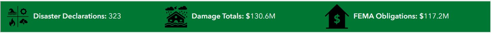

    - **Disaster Declarations Indicator Widget**: Provides a dynamic count of total disaster declarations. When the user applies a filter this indicator updates using this expression COUNT(`ObjectID`). The indicator icon is available [here](../images/fema-decs/dec-explorer-declarations-icon.png)
        
    - **Damage Totals Indicator Widget**: Provides a dynamic sum of damage totals in U.S dollars. When the user applies a filter this indicator updates using this expression SUM(`Total_Cost`). The indicator icon is available [here](../images/fema-decs/dec-explorer-damages-icon.png.png)
    
    - **FEMA Obligations Indicator Widget**: Provides a dynamic count of total disaster declarations. When the user applies a filter this indicator updates using this expression SUM(`FEMA_Obligated`). The indicator icon is available [here](../images/fema-decs/dec-explorer-obligations-icon.png.png)

### Web Map Contents

The dashboard contains a web map named Vermont FEMA Declaration Explorer, which is accessible [here](https://vtem.maps.arcgis.com/apps/mapviewer/index.html?webmap=99eb7c25be674280b9e201197709f880). The web map contains two feature layers; there are no filteres applied to the data, and no Arcade used for symbology.

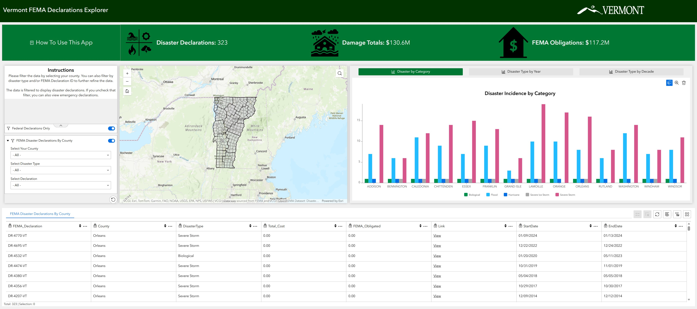

#### Active Layers

| Group | Layer Name | Type | Source |
|-------|------------|------|--------|
| | FEMA Disaster Declarations By County | ESRI Basic Polygon | [VEM](https://services9.arcgis.com/cb6eDXWVgAvVXeIK/arcgis/rest/services/VT_FEMA_Disaster_Events_by_County_20250801_152948/FeatureServer) Python Notebook |
| Boundaries | Vermont Towns | ESRI Basic Polygon | [VCGI](https://services1.arcgis.com/BkFxaEFNwHqX3tAw/arcgis/rest/services/FS_VCGI_OPENDATA_Boundary_BNDHASH_poly_towns_SP_v1/FeatureServer/0) |

!!! info ":material-home-flood:  VT Disaster Declarations Extraction Notebook"
    Extracts and Summarizes FEMA disaster declarations in Vermont.  This notebook is manually executed after a new declaration has been announced. You can view the full, documented code in the VCGI repository below:

    [ :material-github: **VCGI / vem-gis-tools / Disaster Declarations** ](https://github.com/VCGI/vem-gis-tools/blob/main/etl/VT-Disaster-Declarations-Extraction.ipynb){ .md-button .vt-green-btn }
    
    
    

### Filter Widgets
There are two Filter widgets available for the user to refine the visualization. When a filter is applied or removed, the indicator widgets update, the map zooms to the area of interest, the charts display relevant data, and the table displays relevant records.

??? info "Click For More Info"

    - **Federal Declarations Only**: This filter is turned on by default to filter out emergency declarations. See [here](https://www.fema.gov/node/how-emergency-declaration-different-presidential-declaration) for more information on the distinction.
        
        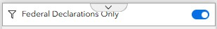

    - **FEMA Disaster Declarations By County**: This filter allows the user to select a county of interest, a disaster type of interest, and a declaration number if known.

        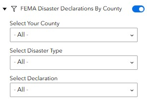  

        - **Filter Options**: The tables below summarizes the available attributes for each filter:

        

        

        | Counties |
        | :--- |
        | Addison |
        | Bennington |
        | Caledonia |
        | Chittenden |
        | Essex |
        | Franklin |
        | Grand Isle |
        | Lamoille |
        | Orange |
        | Orleans |
        | Rutland |
        | Washington |
        | Windham |
        | Windsor |        

        

        

        | Disaster Types |
        | :--- |
        | Biological |
        | Flood |
        | Hurricane |
        | Severe Ice Storm |
        | Severe Storm |

        

        

        | FEMA Declaration #s |
        | :--- |
        | [DR-277-VT](https://www.fema.gov/disaster/277) |
        | [DR-397-VT](https://www.fema.gov/disaster/397) |
        | [DR-518-VT](https://www.fema.gov/disaster/518) |
        | [DR-712-VT](https://www.fema.gov/disaster/712) |
        | [DR-840-VT](https://www.fema.gov/disaster/840) |
        | [DR-875-VT](https://www.fema.gov/disaster/875) |
        | [DR-938-VT](https://www.fema.gov/disaster/938) |
        | [DR-990-VT](https://www.fema.gov/disaster/990) |
        | [DR-1063-VT](https://www.fema.gov/disaster/1063) |
        | [DR-1101-VT](https://www.fema.gov/disaster/1101) |
        | [DR-1124-VT](https://www.fema.gov/disaster/1124) |
        | [DR-1184-VT](https://www.fema.gov/disaster/1184) |
        | [DR-1201-VT](https://www.fema.gov/disaster/1201) |
        | [DR-1228-VT](https://www.fema.gov/disaster/1228) |
        | [DR-1307-VT](https://www.fema.gov/disaster/1307) |
        | [DR-1336-VT](https://www.fema.gov/disaster/1336) |
        | [DR-1358-VT](https://www.fema.gov/disaster/1358) |
        | [DR-1428-VT](https://www.fema.gov/disaster/1428) |
        | [DR-1488-VT](https://www.fema.gov/disaster/1488) |
        | [DR-1559-VT](https://www.fema.gov/disaster/1559) |
        | [DR-1698-VT](https://www.fema.gov/disaster/1698) |
        | [DR-1715-VT](https://www.fema.gov/disaster/1715) |
        | [DR-1778-VT](https://www.fema.gov/disaster/1778) |
        | [DR-1784-VT](https://www.fema.gov/disaster/1784) |
        | [DR-1790-VT](https://www.fema.gov/disaster/1790) |
        | [DR-1951-VT](https://www.fema.gov/disaster/1951) |
        | [DR-1995-VT](https://www.fema.gov/disaster/1995) |
        | [DR-4001-VT](https://www.fema.gov/disaster/4001) |
        | [DR-4022-VT](https://www.fema.gov/disaster/4022) |
        | [DR-4043-VT](https://www.fema.gov/disaster/4043) |
        | [DR-4066-VT](https://www.fema.gov/disaster/4066) |
        | [DR-4120-VT](https://www.fema.gov/disaster/4120) |
        | [DR-4140-VT](https://www.fema.gov/disaster/4140) |
        | [DR-4163-VT](https://www.fema.gov/disaster/4163) |
        | [DR-4178-VT](https://www.fema.gov/disaster/4178) |
        | [DR-4207-VT](https://www.fema.gov/disaster/4207) |
        | [DR-4232-VT](https://www.fema.gov/disaster/4232) |
        | [DR-4330-VT](https://www.fema.gov/disaster/4330) |
        | [DR-4356-VT](https://www.fema.gov/disaster/4356) |
        | [DR-4380-VT](https://www.fema.gov/disaster/4380) |
        | [DR-4445-VT](https://www.fema.gov/disaster/4445) |
        | [DR-4474-VT](https://www.fema.gov/disaster/4474) |
        | [DR-4532-VT](https://www.fema.gov/disaster/4532) |
        | [DR-4621-VT](https://www.fema.gov/disaster/4621) |
        | [DR-4695-VT](https://www.fema.gov/disaster/4695) |
        | [DR-4720-VT](https://www.fema.gov/disaster/4720) |
        | [DR-4744-VT](https://www.fema.gov/disaster/4744) |
        | [DR-4762-VT](https://www.fema.gov/disaster/4762) |
        | [DR-4770-VT](https://www.fema.gov/disaster/4770) |
        | [DR-4810-VT](https://www.fema.gov/disaster/4810) |
        | [DR-4816-VT](https://www.fema.gov/disaster/4816) |
        | [DR-4826-VT](https://www.fema.gov/disaster/4826) |

        

        

        - **Filter Trigger**: When the user selects a county of interest, the map zooms to the county. This is accomplished by applying an action to the filter:     
        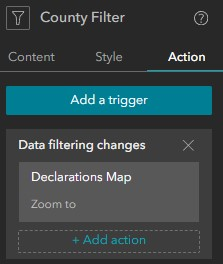

        - **Reset Filters**: The user can reset all filters and refresh the dashboard view by clicking the Refresh Filters icon:     
        

### Interactive Charts
The dashboard contains three column charts that dynamically updated based on selections made using the Category Selector Filters. All of the charts pull data from the FEMA Disaster Declarations by County feature layer.

#### Disaster By Category

??? info "Click For More Info"
    This column chart displays a count of `DisasterType` grouped by `CNTYNAME` from the FEMA Disaster Declarations by County feature layer.

    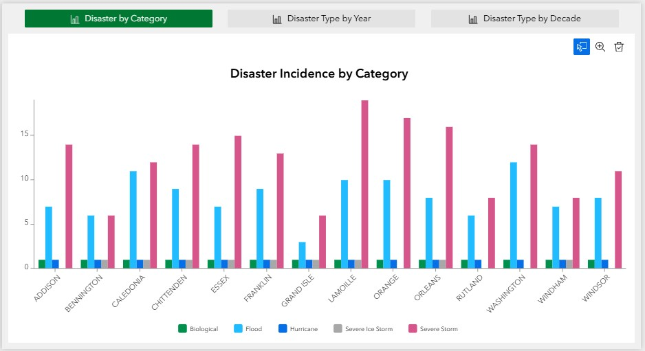

    The chart was set up using the following settings:  
    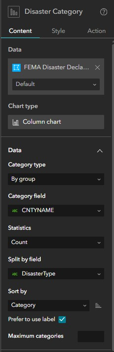

#### Disaster Type By Year

??? info "Click For More Info"
    This column chart displays a stacked count of `DisasterType` grouped by `Year` from the FEMA Disaster Declarations by County feature layer.

    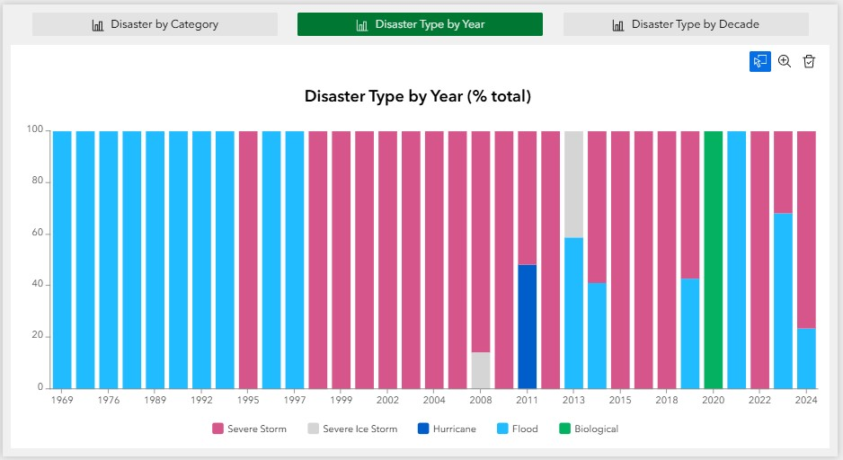

    The chart was set up using the following settings:  
    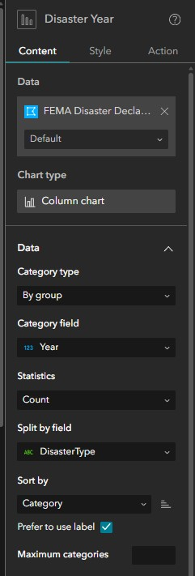

#### Disaster Type By Decade

??? info "Click For More Info"
    This column chart displays a stacked count of `DisasterType` grouped by `IndcidentDate` from the FEMA Disaster Declarations by County feature layer. The time interval was set to 10 years to reflect disaster type by decade.

    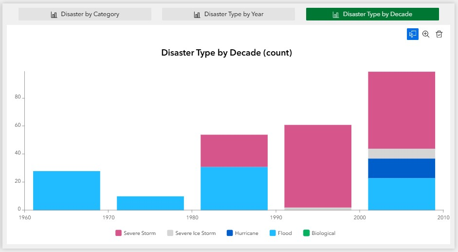

    The chart was set up using the following settings:  
    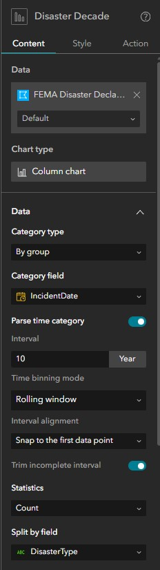

### Dynamic Table
The dashboard contains a dynamic table that allows users to review information related to specific counties, disaster types, and declarations. Users can also export a CSV file of the table for use in other applications.

??? info "Click For More Info"
    When the user applies a filter, the table dynamically relevant records with the following attributes:

    **Table Attributes:**

    - `FEMA_Declaration`: Complete FEMA disaster declaration identification number
    - `DisasterID`: FEMA disaster declaration identification number
    - `IncidentDate`: The date the disaster event actually occurred, derived from FEMA's `incidentBeginDate`.
    - `Year`: The four-digit year (e.g., 2023) the disaster took place, extracted directly from the start date of the incident.
    - `County`: Designated county name
    - `DisasterType`: The general category of the incident (mapped from FEMA's `incidentType`). Common examples in Vermont include "Flood", "Severe Storm", "Winter Storm", or "Biological" (like COVID-19).
    - `Total_Cost`: The aggregate sum of the `projectAmount` from FEMA's Public Assistance data, grouped by disaster and county. This represents the total estimated or actual cost of all eligible recovery and repair projects for that specific disaster in that specific county.
    - `FEMA_Obligated`: The aggregate sum of the `federalShareObligated` field from the Public Assistance data. This represents the actual dollar amount that FEMA approved and committed to pay toward the Total_Cost of those projects.
    - `Link`: A dynamically generated URL (e.g., https://www.fema.gov/disaster/4720) that acts as a direct link to the official FEMA webpage for that specific disaster declaration, where users can find more detailed summaries and news.
    - `StartDate`: A text-formatted version (MM/DD/YYYY) of the `incidentBeginDate`.
    - `EndDate`: A text-formatted version (MM/DD/YYYY) of the `incidentEndDate`.

    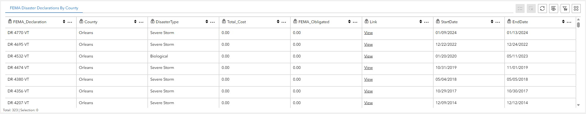

    **CSV Export:**
    Users can export a CSV or filtered or unfiltered records from the table using the Actions pane, which can be accessing by clicking this icon 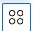. Within the Actions pane, users can select Export > Export to CSV.  
    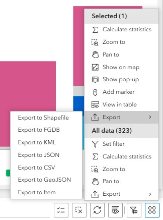

---
## Feedback

If you have suggestions for improving this page or need additional functionality, contact [John Van Hoesen](mailto:john.vanhoesen@vermont.gov).