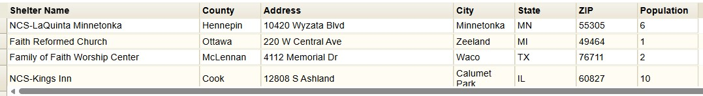

# Mass Care Page

The mass care page provides a summary of mass care, emergency assistance, temporary housing, and human services available in Vermont during SEOC activation.

!!! warning "Under Development"
    This page currently contains an embedded map from the American Red Cross depicting open shelters. A new map containining additional mass care data layers is under development and this page will be updated when complete.

## Purpose

This page provides:

- Near real-time summary of open shelters in Vermont
- ⚠️ UPDATE WITH NEW MAP
- ⚠️ UPDATE WITH NEW MAP

## Mass Care Page Layout

The page uses a **fullscreen layout** with the following components:

1. **Header**: Application title, dynamic status text and color, date/time, and logo. Review the COP [Overview Page](overview-page.md/#header-section) for more details.
2. **Navigation**: Tab-based navigation between different views. Review the COP [Overview Page](overview-page.md/#header-section) for more details.
3. **Map Area**: Primary interactive map area.

### Map Section
The primary visual of the page uses an Embed Widget to display an American Red Cross Shelter map that contains open shelters and a table summarizing shelter information. The original map is accessible [here](https://maps.redcross.org/website/maps/ARC_Shelters.html) page. The map contains Zoom Controls, Home Button, Search, and Find My Location tools directly on map.

The user can explore information about each shelter by clicking on the Open Shelters symbol, which will reveal a popup containing the shelter name and address. 
    

        
        
    

The user can also explore the data table at the bottom of the map, which summarizes shelter name and address. The table also includes a Population field, which indicates the number of people currently residing in the shelter.

## Related Pages

- [Infrastructure Page](infrastructure-page.md) - Transportation status
- [Overview Page](overview-page.md) - Transportation status
- [Weather Page](weather-page.md) - Transportation status

## Feedback

If you have suggestions for improving this page or need additional functionality, contact [John Van Hoesen](mailto:john.vanhoesen@vermont.gov).
