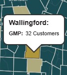
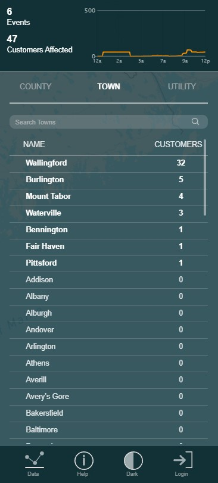
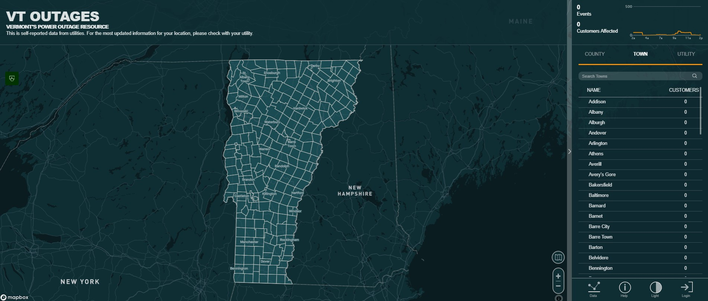

# VT Outages Page

The VT outages page provides easy access to the VT Outages website, which displays near real-time status of power outages in Vermont.

!!! warning "Data Warning"
    The data on this site is self-reported by utilties and many smaller utilities are not able to share outage status using this platform.

## Purpose

This page provides:

- Near real-time reporting of power outages by utility in Vermont
- Summary of current wildfire incidents and perimeters
- Metorologic conditions reported by and RAWS and NWS weather stations

## VT Outages Page Layout

The page uses a **fullscreen layout** with the following components:

1. **Header**: Application title, dynamic status text and color, date/time, and logo. Review the COP [Overview Page](overview-page.md/#header-section) for more details.
2. **Navigation**: Tab-based navigation between different views. Review the COP [Overview Page](overview-page.md/#header-section) for more details.
3. **Map Area**: Primary interactive map area.
4. **Side Column**: Widget for data display and interaction.

### Map Section
The primary visual of the page uses an Embed Widget to display the VT Outages map, which can be toggled between Town, County, and responsible Utility. The original map is accessible [here](https://vtoutages.org/) page.

??? info "Click For More Info"
    The user can toggle between the three views illustrated below using text filters in the right column.
    

            <figure style="margin: 0; flex: 1; text-align: center;">
                
                <figcaption style="font-size: 0.85em; color: #666; margin-top: 5px;">Town View</figcaption>
            </figure>
            <figure style="margin: 0; flex: 1; text-align: center;">
                
                <figcaption style="font-size: 0.85em; color: #666; margin-top: 5px;">County View</figcaption>
            </figure>
            <figure style="margin: 0; flex: 1; text-align: center;">
                
                <figcaption style="font-size: 0.85em; color: #666; margin-top: 5px;">Utility View</figcaption>
            </figure>
        

    When the user hovers over any of the highlighted towns, counties, or utilities, additional information about responsible utility and number of impacted residents is displayed. 
    

    Users can view the map legend by clicking on the unfolded map icon in the lower right corner of the map.
    

        
        
    

    There is also a Widget Controller on the map that provides easy access to [PowerOutage.com](https://poweroutage.us/), an external website reporting regional power outages. 
    

### Sidecar Section
The right side of the page displays a sidecar the can expand/contract containing interactive elements that allows users to explore power outage data by county, town, and utility.

??? info "Click For More Info"

    - **Interactive Sidecar**: The sidecar container displays text filters (COUNTY, TOWN, UTILITY) that update interactive graphs, tables, and map view when selected. The user can also search by County, Town, or Utility name if known to filter the data manually. 
        

    - **VT Outages Data Interface**: If the user clicks on the Data icon in the bottom row of the sidecar, they can explore outage history by town and review county outages in table format. 
            

            
            
            

    - **VT Outages Help Interface**: The user can review helpful guidance and contact information by clicking the Help icon.
        
        

    - **VT Outages Theme Interface**: The user can toggle between light and dark themes by clicking the Light/Dark icon.
        
        

## Related Pages

- [Mass Care Page](mass-care-page.md) - Detailed fire danger and current wildfire status
- [Infrastructure Page](infrastructure-page.md) - Transportation status

## Feedback

If you have suggestions for improving this page or need additional functionality, contact [John Van Hoesen](mailto:john.vanhoesen@vermont.gov).
