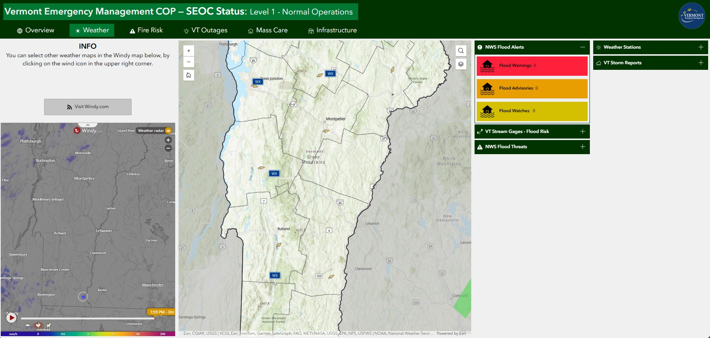
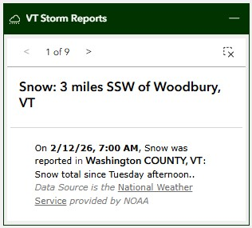

# Weather Page

The Weather page provides a comprehensive, near real-time overview of meteorologic and hydrologic conditions in Vermont.

## Purpose

This page provides:

- Quick overview of weather conditions
- Summary of weather alerts and storm reports
- Weather related radar products (e.g., wind, precipitation, etc.)
- Quick access to stream hydrologic conditions

## Weather Page Layout

The page uses a **fullscreen layout** with the following components:

1. **Header**: Application title, dynamic status text and color, date/time, and logo. Review the COP [Overview Page](overview-page.md/#header-section) for more details.
2. **Navigation**: Tab-based navigation between different views. Review the COP [Overview Page](overview-page.md/#header-section) for more details.
3. **Map Area(s)**: Primary interactive map areas.
4. **Side Columns**: Widgets for data display and interaction.

### Sidecar Section
The left side of the page contains a Sidecar Widget the user can expand/contact. It contains the following elements:

??? info "Click For More Info"

    - **Sidecar Widget**: The upper container is expanded by default and displays help info to the user. When collapsed the user can interact with the Windy map and the embedded Weather map for comparison.   The user can also change the data product displayed in the embedded Windy map by clicking the orange wind icon (next to the Weather radar label). The Windy map has time enabled radar so the user can evaluate future conditions and can also expand the map in a new browser window if they prefer.
            

            
            
            

### Map Section
The center visual of the page contains the weather map. For more information on the data layers displayed in the map, visit the [Weather Map](../maps/weather-map.md) page. The map widget contains the same Zoom Controls, Home Button, Search, and Layers Toggle tools as the Overview Map. Please review those tool features [here](overview-page.md/#map-section).

### Accordian Sections
The right side of the page displays two columns containing accordian widgets, which allow users to expand/contract content linked to data layers in the map.

??? info "Click For More Info"

    - **VT Flood Alerts Accordian Widget**: The primary accordian widget contains a Row Widget, which contains an Image Widget and Text Widget. Eacth text widget is linked to the [Current NWS Events](https://services9.arcgis.com/RHVPKKiFTONKtxq3/arcgis/rest/services/NWS_Watches_Warnings_v1/FeatureServer/6) layer. The `Current NWS Events` layer was filtered for each of the three text widgets (e.g., the Flood Warning text widget was filtered as shown below).  
            

            
            
            

        The background colors in the text boxes are static not dynamic:    
        - Flood Warnings =  (#ff203c).
        - Flood Advisories =  (#e89d00).
        - Flood Watches =  (#d4c000).  

    - **VT Stream Gauges - Flood Risk Accordian Widget**: The primary accordian widget contains a Feature Info Widget linked to the [USGS Live Stream Gauges](https://services9.arcgis.com/RHVPKKiFTONKtxq3/arcgis/rest/services/Live_Stream_Gauges_v1/FeatureServer/0) layer. The user can navigate between eatch feature summary using the navigation arrows. When the user navigates through each entry, the map zoomes to the selected stream gauge on the map. The user can clear the selected stream gaauge and reset the map view by clicking on the clear selection button (x inside dashed square). If the user clicks on the USGS hydrograph snapshot, a larger version will open in a new browser window. 
        
        

    - **Weather Stations Accordian Widget**: The primary accordian widget contains a Feature Info Widget linked to the [NWS Weather Stations](https://services9.arcgis.com/RHVPKKiFTONKtxq3/arcgis/rest/services/NOAA_METAR_current_wind_speed_direction_v1/FeatureServer/0) layer. The user can navigate between eatch feature summary using the navigation arrows. When the user navigates through each entry, the weather station is highlighted on the map. The user can clear the highlighting by clicking on the clear selection button (x inside dashed square).
        
        

    - **VT Storm Reports Accordian Widget**: The primary accordian widget contains a Feature Info Widget linked to the [NWS USA Storm Reports](https://rhvpkkiftonktxq3.svcs9.arcgis.com/RHVPKKiFTONKtxq3/ArcGIS/rest/services/NOAA_storm_reports_v1/FeatureServer/4) layer. The user can navigate between eatch feature summary using the navigation arrows. When the user navigates through each entry, the storm report is highlighted on the map. The user can clear the highlighting by clicking on the clear selection button (x inside dashed square).
        
        

## Best Practices

### Performance Optimization
- Keep 4-5 layers active for best performance
- Use appropriate zoom levels for data visibility
- Clear old incidents and events periodically
- Close unused widgets when not needed

### Data Interpretation
- Check timestamps on data feeds
- Verify alert severity levels
- Cross-reference multiple data sources
- Consider data aggregation levels

## Related Pages

- [Fire Risk Page](fire-risk-page.md) - Detailed fire danger and current wildfire status
- [VT Outages Page](vt-outages-page.md) - Power outage tracking
- [Infrastructure Page](infrastructure-page.md) - Transportation status

## Feedback

If you have suggestions for improving this page or need additional functionality, contact [John Van Hoesen](mailto:john.vanhoesen@vermont.gov).