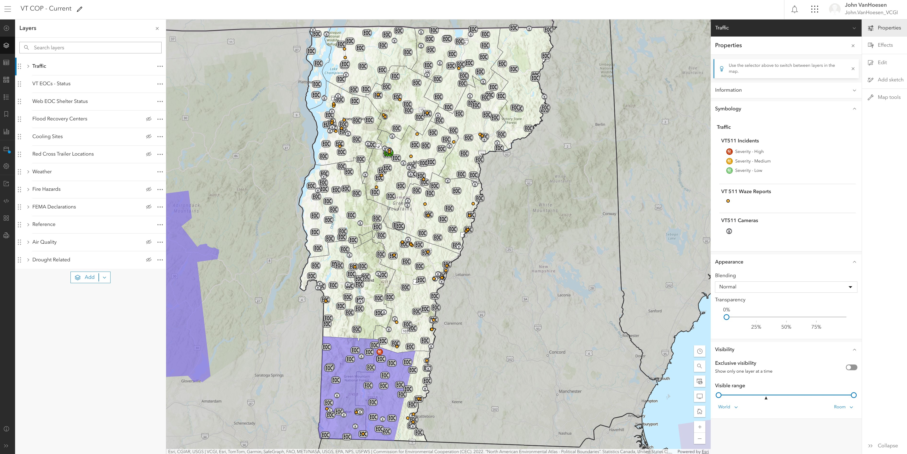
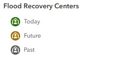
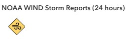
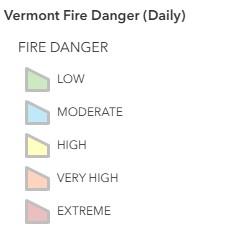

# Situational Awareness Map: (VT COP - Overview)

The Situational Awareness map provides a comprehensive, real-time view of current conditions across Vermont by integrating multiple data sources to support emergency operations.


*The situational awareness map (named VT Cop - Current) is accessible [here](https://vtem.maps.arcgis.com/apps/mapviewer/index.html?webmap=b05da43846514d57aab5e9300ca79e7f). It contains both grouped and ungrouped layers from internal and external sources.*

## Purpose

This map serves as the primary situational awareness guide for:

- Day-to-day monitoring of Vermont conditions
- Initial event assessment
- Coordination between agencies
- Public information briefings

## Data Layers

### Active Layers

!!! warning "Layer Visibility"
    Many layers are only turned on (visbile by Default) seasonally or during SEOC activation. For example, Flood Recovery Centers would only be turned on by default during a flood disaster.

| Group | Layer Name | Symbology | Source |
|-------|------------|----------------|-------------|
|  | VT EOCs - Status | Classified by `status` | [VEM](https://vtem.maps.arcgis.com/home/item.html?id=77b187df5ac848caa987440f01e6d4a7&sublayer=1) |
|  | WebEOC Shelter Status | Classified by `status` | [VEM](https://vtem.maps.arcgis.com/home/item.html?id=33bf26076dc2417781babf229a5558d8&sublayer=1) |
|  | Flood Recovery Centers | Classified by `center status`  | [VEM](https://vtem.maps.arcgis.com/home/item.html?id=e8073b08a3364f47ba8ac27232c8459c&sublayer=3) |
|  | Cooling Sites | Classified by `SiteTypeMap` | [VDH](https://maps.healthvermont.gov/arcgis/rest/services/VDH/EnvHealthCoolingSites_Public/MapServer/0) |
|  | Red Cross Trailer Locations | ESRI basic point | [Red Cross](https://services.arcgis.com/pGfbNJoYypmNq86F/ArcGIS/rest/services/ARCNNETrailerLocations/FeatureServer/0) |
| Traffic | VT 511 Incidents | Classified by `severity` | [VT 511](https://gis.ne-compass.com/server/rest/services/Hosted/Vermont_View/FeatureServer/2) |
| Traffic | VT 511 Waze Reports | Classified by `ReportType` | [VT 511](https://services9.arcgis.com/cb6eDXWVgAvVXeIK/arcgis/rest/services/Vermont_511_Waze_Reports_20250826_232835501446/FeatureServer/0) |
| Traffic | VT 511 Cameras | ESRI basic point | [VT 511](https://gis.ne-compass.com/server/rest/services/Hosted/Vermont_View/FeatureServer/0) |
| Weather | USA Storm Reports | Classified by `INCIDENT_TYPE` | [NOAA](https://rhvpkkiftonktxq3.svcs9.arcgis.com/RHVPKKiFTONKtxq3/ArcGIS/rest/services/NOAA_storm_reports_v1/FeatureServer/4) |
| Weather | NOAA Hail Storm Reports | ESRI basic point | [NOAA](https://services9.arcgis.com/RHVPKKiFTONKtxq3/arcgis/rest/services/NOAA_storm_reports_v1/FeatureServer/0) |
| Weather | NOAA Wind Storm Reports | ESRI basic point | [NOAA](https://services9.arcgis.com/RHVPKKiFTONKtxq3/arcgis/rest/services/NOAA_storm_reports_v1/FeatureServer/2) |
| Weather | Current NWS Events | Classified by `Subject Type` | [NOAA](https://services9.arcgis.com/RHVPKKiFTONKtxq3/arcgis/rest/services/NWS_Watches_Warnings_v1/FeatureServer/6) |
| Weather | NOAA Severe Thunderstorm Warnings | ESRI basic polygon | [NOAA](https://services9.arcgis.com/RHVPKKiFTONKtxq3/arcgis/rest/services/NOAA_short_term_warnings_v1/FeatureServer/0) |
| Weather | NOAA Tornado Warnings | ESRI basic polygon | [NOAA](https://services9.arcgis.com/RHVPKKiFTONKtxq3/arcgis/rest/services/NOAA_short_term_warnings_v1/FeatureServer/1) |
| Weather | NOAA Flash Flood Warnings | ESRI basic polygon | [NOAA](https://services9.arcgis.com/RHVPKKiFTONKtxq3/arcgis/rest/services/NOAA_short_term_warnings_v1/FeatureServer/2) |
| Weather | NOAA Special Marine Warnings | ESRI basic polygon | [NOAA](https://services9.arcgis.com/RHVPKKiFTONKtxq3/arcgis/rest/services/NOAA_short_term_warnings_v1/FeatureServer/3) |
| Weather | Active Hurricanes, Cyclones, & Typhoons | Multiple layers | [NOAA](https://services9.arcgis.com/RHVPKKiFTONKtxq3/arcgis/rest/services/Active_Hurricanes_v1/FeatureServer) |
| Fire | Vermont Fire Danger (Daily) | Classified by `FIREDANGER` | [VTFPR](https://anrmaps.vermont.gov/arcgis/rest/services/map_services/MAP_ANR_ANRATLASFPR_WM_NOCACHE/MapServer/50) |
| Fire | Current Wildfire Incidents | Classified by `Wildfire Incidents (Acres)` | [NIFC](https://services9.arcgis.com/RHVPKKiFTONKtxq3/arcgis/rest/services/USA_Wildfires_v1/FeatureServer/0) |
| Fire | Current Wildfire Perimeters | Classified by `Category` | [NIFC](https://services9.arcgis.com/RHVPKKiFTONKtxq3/arcgis/rest/services/USA_Wildfires_v1/FeatureServer/1) |
| FEMA | FEMA Designated Counties | Classified by `designate` | [FEMA](https://gis.fema.gov/arcgis/rest/services/FEMA/DECS_ALL/FeatureServer/0) |
| FEMA | FEMA Emergency Designated Counties | ESRI basic polygon | [FEMA](https://gis.fema.gov/arcgis/rest/services/FEMA/DECS_ALL/FeatureServer/1) |
| Air Quality | AirNow Air Quality | Classified by `Ozone & PM AQI` | [EPA](https://www.arcgis.com/home/item.html?id=2d718d2733a74d1689d72b922c0ac4f4) |
| Air Quality | Canada Wildfire Smoke Forecast | ESRI Image Service | [ESRI](https://enterpriseim.esriservices.ca/server/rest/services/Hosted/Canada_Wildfire_Smoke_Service/ImageServer) |
| Drought| Public Reports CMOR | ESRI basic point | [CMOR](https://services5.arcgis.com/0OTVzJS4K09zlixn/ArcGIS/rest/services/CMOR_2022_Public/FeatureServer/0) |
| Drought | US Drought Monitor -Current | Classified by `DM` | [USDM](https://services5.arcgis.com/0OTVzJS4K09zlixn/ArcGIS/rest/services/USDM_current/FeatureServer/0) |


### Tables
These feature services are not symbolized on the map but are used to populate widgets.

<div class="no-datatable" markdown="1">

| Group | Layer Name | Type | Source |
|-------|------------|------|--------|
| Tables | Boil Water Notices | No Symbology | [VTANR](https://services5.arcgis.com/0OTVzJS4K09zlixn/ArcGIS/rest/services/USDM_current/FeatureServer/0) |
| Tables | Boil Water Notices - Storm Related | No Symbology | [VTANR](https://anrmaps.vermont.gov/arcgis/rest/services/map_services/MAP_ANR_ANRATLASDWGWP_WM_NOCACHE/MapServer/18) |
| Tables | Reported Spills (ANR) | No Symbology | [VTANR](https://anrmaps.vermont.gov/arcgis/rest/services/map_services/MAP_ANR_ANRATLASDWGWP_WM_NOCACHE/MapServer/17) |

</div>

### Reference Layers

<div class="no-datatable" markdown="1">

| Group | Layer Name | Type | Source |
|-------|------------|------|--------|
| Boundaries | U.S. States and Territories | Polygon | [NOAA](https://services9.arcgis.com/RHVPKKiFTONKtxq3/arcgis/rest/services/NWS_Watches_Warnings_v1/FeatureServer/4) |
| Boundaries | Vermont Counties | Polygon | [VCGI](https://geodata.vermont.gov/datasets/VCGI::vt-data-county-boundaries-1/about) |
| Boundaries | NA Political Divisions Polygons (mask) | Polygon | [NAEA](https://services7.arcgis.com/oF9CDB4lUYF7Um9q/arcgis/rest/services/NA_Political_Divisions_Polygons/FeatureServer/6) |

</div>

## Layer Details

### Internal Sources
*The following layers are consumed from VEM's AGO. Some of these layers pull data entered into WebEOC boards by VEM or AHS, others include data extracted from external sources using ETL Python notebooks.*

??? info "VT EOC - Status"
    **Source:** [VEM AGO Feature Layer](https://vtem.maps.arcgis.com/home/item.html?id=77b187df5ac848caa987440f01e6d4a7&sublayer=1)  
    **Geometry Type:** Point  
    **Coordinate System:** Vermont State Plane (EPSG:32145)  
    **Update Method:** Manually updated by VEM during activations

    **Pop-Up Attributes:**
    
    - `name`: EOC location name
    - `address`: Full address
    - `town`: Town name
    - `status`: Level 1 - Normal Operations, Level 2 - Enhanced Operations, Level 3 - Partial Activation, Level 4 - Full Activation, Inactive, Unknown
    - `type`: Municipal EOC, State of Vermont EOC
    - `site_preference`: Primary Location, Alternative Location
    - `note`: Relevant notes

    **Symbology:**

    
    Color-coded by `Status`<br>
    Icon: EOC symbol imported from [NAPSG  Resources Stylesheet](https://www.arcgis.com/home/item.html?id=492df16d20934e989952c0366f0aadbf)<br><br>
        

    !!! warning "EOC Status Updates"
        Municipal EOC updates are inconsistent and often aren't updated after an EOC closes. Verify current status with local EMD before directing individuals.

??? info "WebEOC Shelter Status"
    **Source:** [VEM AGO Feature Layer](https://vtem.maps.arcgis.com/home/item.html?id=33bf26076dc2417781babf229a5558d8&sublayer=1)  
    **Geometry Type:** Point  
    **Coordinate System:** Web Mercator (EPSG:3857)  
    **Update Method:** Manually updated by AHS during activations

    **Pop-Up Attributes:**
    
    - `shelter_name`: Facility name
    - `address`: Street address
    - `town`: Municipality
    - NEED TO UPDATE LINK AND FIELDS AFTER NEW BOARD IS PUBLISHED


    **Symbology:**

    Color-coded by `Status`<br>
    Icon: EOC symbol imported from [ESRI Public Safety Stylesheet](https://esri-styles.maps.arcgis.com/home/item.html?id=b75a84b25d084eefadb87b57c50939f6)<br><br>
        

    !!! warning "Shelter Status Updates"
        VT shelter status is manually updated by AHS via WebEOC. Verify current status with AHS before directing individuals.

??? info "Flood Recovery Centers"
    **Source:** [VEM AGO Feature Layer](https://vtem.maps.arcgis.com/home/item.html?id=e8073b08a3364f47ba8ac27232c8459c&sublayer=3)  
    **Geometry Type:** Point  
    **Coordinate System:** Web Mercator (EPSG:3857)  
    **Update Method:** Manually updated by AHS during activations

    **Pop-Up Attributes:**
    
    - `name`: Center name
    - `address`: Full address
    - `center_type`: State Disaster Recovery Center (SDRC), Federal Disaster Recovery Center (FDRC)
    - `center_status`: Today, Past, Future
    - `manager_name`: Center manager
    - `manager_phone`: Manager phone number
    - `start_date`: Center opening date
    - `end_date`: Center closing date
    - `fema_present`: FEMA representative at center (Yes, No)
    - `ahs_present`: VT Agency of Human Services representative at center (Yes, No)
    - `redcross_present`: Red Cross representative at center (Yes, No)
    - `sal_army_present`: Salvation Army representative at center (Yes, No)
    - `dfr_present`: VT Department of Financial Regulation representative at center (Yes, No)
    - `dfs_present`: VT Division of Fire Safety representative at center (Yes, No)
    - `uw_present`: United Way representative at center (Yes, No)
    - `vdol_present`: VT Department of Labor representative at center (Yes, No)
    - `aoe_present`: VT Agency of Education representative at center (Yes, No)
    - `esd_present`: VT Economic Services Division representative at center (Yes, No)
    - `da_present`: VT Designgated Agencies for Mental Health representative at center (Yes, No)
    - `vdh_present`: VT Department of Health representative at center (Yes, No)
    - `days_open`: Mondays & Fridays, Tuesdays & Fridays, Wednesday & Sundays, Thursdays

    **Symbology:**

    Color-coded by `Status`<br>
    Icon: Shelter symbol imported from [ESRI Public Safety Stylesheet](https://esri-styles.maps.arcgis.com/home/item.html?id=b75a84b25d084eefadb87b57c50939f6)<br><br>
        

    !!! warning "Recovery Center Status Updates"
        VT recovery center status is manually updated by AHS via WebEOC. Verify current status with AHS before directing individuals.

??? info "VT 511 Waze Reports"
    **Source:** [VT 511](https://services9.arcgis.com/cb6eDXWVgAvVXeIK/arcgis/rest/services/Vermont_511_Waze_Reports_20250826_232835501446/FeatureServer/0)  
    **Geometry Type:** Point  
    **Coordinate System:** Web Mercator (EPSG:3857)  
    **Update Method:** Needs to be updated using a Python Notebook [hosted in VEM's AGO](https://vtem.maps.arcgis.com/home/item.html?id=8c41769fbdba404695350997f3cfb543)

    **Pop-Up Attributes:**
    
    - `description`: Summary of incident
    - `street`: Street address
    - `city`: Vermont City/Town
    - `last_update`: Last update time
    - `report_type`: Incident type (e.g., construction, accident, etc.)
    - `report_time`: Original report time

    **Symbology:**

    Color-coded by `report_type`<br>
    Icon: Point symbol from ESRI basic points<br><br>
        

    !!! warning "VT 511 Waze Updates"
        During an SEOC activation, this layer needs be upted by running a Python notebook to dispaly up-to-date information.<br><br>There is often a delay in closing out VT 511 waze reports. Verify current status with live [VT 511 website](https://newengland511.org/region/Vermont) before directing individuals.

### External Sources
*The following layers are consumed from external, authoritative sources. These sources include Vermont agencies and departments and external partners like the NWS, USGS, FEMA, etc.*

??? info "Cooling Sites"
    **Source:** [VEM AGO Feature Layer](https://maps.healthvermont.gov/arcgis/rest/services/VDH/EnvHealthCoolingSites_Public/MapServer/0)  
    **Geometry Type:** Point  
    **Coordinate System:** Web Mercator (EPSG:3857)  
    **Update Method:** Manually updated by VDH

    **Pop-Up Attributes:**
    
    - `SiteName`: Cooling center location name
    - `SiteType`: Shelter location type (e.g., Recreational Center, Library, Police Department, etc.)
    - `SiteTypeMap`: Indoor cooling site - open during normal hours, Occasional cooling facilities (call first), Recreation sites with water access that usually charges an entry fee, Free recreation sites with water access.
    - `ADACompliant`: Yes, No, Unknown
    - `Address`: Street address
    - `City`: Town name
    - `County`: Vermont county
    - `BeachClosure`: Open, Closed, Unknown
    - `ContactPhone`: Site phone number
    - `CoolingCenter`: Yes, No
    - `EntryFee`: Yes, No, Unknown
    - `Extended Hours`: Yes, No, Possible, call to check, Possible during an emergency, Possible during a heat emergency, Unknown
    - `GeneratorOnSite`: Yes, No, Unknown
    - `HoursOfOperation`: Site hours of operation (variable)
    - `OtherAmenities`: Books and games, Movies, Showers, Wi-fi, Unknown
    - `OtherCoolingCenterAmenities`: Seating in shade, Space for pets, None, Unknown, Shade Tent, etc.
    - `OvernightShelterFacilities`: Yes, No, Unknown
    - `Parking`: Yes, No, Unknown
    - `PetFacilities`: Yes, No, No, but pets are welcome outside, Service animals only
    - `PowerForMedicalEquipment`: Yes, No, Unknown
    - `PublicTransportation`: Yes, No, Unknown
    - `RefrigeratorForMedications`: Yes, No, Unknown
    - `RestroomsAvailable`: Yes, No, Unknown
    - `SitesCyanoReported`: # of cyanobacteria reports for site
    - `SuncreenDispenser`: Yes, No, Unknown
    - `VDHDistrict`: Defined by Vermont counties
    - `WaterAvailable`: Yes, No, Unknown
    - `Website`: Cooling site website if available

    **Symbology:**

    Color-coded by `SiteTypeMap`<br>
    Icon: Geometric symbols imported from ESRI basic points<br><br>
        

    !!! warning "Cooling Center Updates"
        Cooling site information is manually updated VDH. Verify current status with VDH before directing individuals.

??? info "Red Cross Trailer Locations"
    **Source:** [Red Cross](https://services.arcgis.com/pGfbNJoYypmNq86F/ArcGIS/rest/services/ARCNNETrailerLocations/FeatureServer/0)  
    **Geometry Type:** Point  
    **Coordinate System:** Web Mercator (EPSG:3857)  
    **Update Method:** Manually updated by ARC during activations

    **Pop-Up Attributes:**
    
    - `ARC_Use`: Distribution of Emergency Supplies, Logistics Trailer, Shelter Trailer, Logistics Trailer - Pet, Logistics Trailer - Mass Casualty
    - `Deployed_Location_Name`: Name of location where trailer is deployed
    - `DL_Address`: Street address of deployed location
    - `DL_City`: City/Town of deployed location
    - `DL_County`: County of deployed location
    - `DL_Zip_Code`: Zip of deployed location
    - `Housed_Location_Name`: Name of location where trailer is normally housed
    - `HL_Address`: Street address of housed location
    - `HL_City`: City/Town of housed location
    - `HL_County`: County of housed location
    - `HL_Zip_Code`: Zip of housed location
    - `Status`: Available, Unavailable
    - `Tag`: Trailer license plate #
    - `Tag_State`: State where trailer is registered
    - `Temporary_Location`: Temporary location, undeployed
    - `Element_Unit#`: Red Cross trailer ID number
    - `Axles`: Single, Double
    - `Tow_Ball_Size`: 1 7/8", 2", 2 5/16", 2"
    - `VIN`: Trailer VIN number
    - `Year_Man_Series_Model`: Year, Manufacturer, Series/Model

    **Symbology:**

    Color-coded using single symbol style<br>
    Icon: Emergency services symbol from ESRI basic points<br><br>
        

    !!! warning "Trailer Status Updates"
        Red Cross trailer status is manually updated by ARCC. Verify current status with ARC before directing individuals.

??? info "VT 511 Incidents"
    **Source:** [VT 511](https://gis.ne-compass.com/server/rest/services/Hosted/Vermont_View/FeatureServer/2)  
    **Geometry Type:** Point  
    **Coordinate System:** Vermont State Plane (EPSG:32145)  
    **Update Method:** Regularly updated by VTrans

    **Pop-Up Attributes:**
    
    - `description`: Summary of incident
    - `city`: Vermont City/Town
    - `createdtimestamp`: Time of creation
    - `direction`: Cardinal direction of lane travel (East, West, North, South)
    - `severity`: Primary Location, Alternative Location
    - `startdate`: Indicent start date
    - `starttime`: Incident start time
    - `enddate`: Indicent end date

    **Symbology:**

    Color-coded by `Status`<br>
    Icon: Accident symbol imported from [ESRI Public Safety Stylesheet](https://esri-styles.maps.arcgis.com/home/item.html?id=b75a84b25d084eefadb87b57c50939f6)<br><br>
        

    !!! warning "VT 511 Updates"
        There is often a delay in closing out VT 511 incidents. Verify current status with live [VT 511 website](https://newengland511.org/region/Vermont) before directing individuals.

??? info "VT 511 CCTV Images"
    **Source:** [VT 511](https://gis.ne-compass.com/server/rest/services/Hosted/Vermont_View/FeatureServer/0)  
    **Geometry Type:** Point  
    **Coordinate System:** Vermont State Plane (EPSG:32145)  
    **Update Method:** Automatically updated by VTrans CCTV feature layer service

    **Pop-Up Attributes:**
    
    - `name`: Name of location where CCTV camera is located
    - `roadway`: Road/highway name where CCTV is located
    - `direction`: Direction camera is viewing
    - `status`: DeviceOnline, DeviceOffline
    - `Timestamp`: Timestamp of most recent image

    **Symbology:**

    Color-coded by `report_type`<br><br>
    Icon: Camera symbol from ESRI basic points<br><br>
        

    !!! warning "VT 511 CCTV Updates"
        CCTV images are taken at intervals throughout the day, so every image is out-of-date by the time it's being viewed. Verify current status with DPS or VTrans before directing individuals.

??? info "USA Storm Reports (past 24 hours)"
    **Source:** [NOAA](https://rhvpkkiftonktxq3.svcs9.arcgis.com/RHVPKKiFTONKtxq3/ArcGIS/rest/services/NOAA_storm_reports_v1/FeatureServer/4)<br> 
    **Geometry Type:** Point  
    **Coordinate System:** Web Mercator (EPSG:3857)<br> 
    **Update Method:** Updated daily by NOAA/NWS

    **Pop-Up Attributes:**
    
    - `INCIDENT_TYPE`: Type of storm incident (e.g., Heavy Snow, Snow, Sleet, Hail, etc.)
    - `LOCATION`: Description of location
    - `INCIDENT_DATETIME`: Timestamp for storm report
    - `COUNTY`: County name
    - `STATE`: State name
    - `COMMENTS`: Relevant comments
  
    **Symbology:**

    Color-coded by `report_type`<br>
    Icon: Pre-defined symbology by NOAA<br><br>
        

    **Filter:**

    Filtered by `HOURS_OLD` and `location`<br><br>
        

    !!! warning "Data Limitations"
        Weather alert data may be delayed during severe weather events when NWS systems experience heavy load.

??? info "NOAA Hail Storm Reports (past 24 hours)"
    **Source:** [NOAA](https://services9.arcgis.com/RHVPKKiFTONKtxq3/arcgis/rest/services/NOAA_storm_reports_v1/FeatureServer/0)<br> 
    **Geometry Type:** Point  
    **Coordinate System:** Web Mercator (EPSG:3857)<br> 
    **Update Method:** Updated daily by NOAA/NWS

    **Pop-Up Attributes:**
    
    - `LOCATION`: Description of location
    - `UTC_DATETIME`: Timestamp for hail report
    - `COUNTY`: County name
    - `STATE`: State name
    - `COMMENTS`: Relevant comments
  
    **Symbology:**

    ESRI basic point<br>
    Icon: Pre-defined symbology by NOAA<br><br>
        

    **Filter:**

    Filtered by `STATE`<br><br>
        

??? info "NOAA Wind Storm Reports (past 24 hours)"
    **Source:** [NOAA](https://services9.arcgis.com/RHVPKKiFTONKtxq3/arcgis/rest/services/NOAA_storm_reports_v1/FeatureServer/2)<br>
    **Geometry Type:** Point  
    **Coordinate System:** Web Mercator (EPSG:3857)<br>
    **Update Method:** Updated daily by NOAA/NWS

    **Pop-Up Attributes:**
    
    - `LOCATION`: Description of location
    - `UTC_DATETIME`: Timestamp for hail report
    - `COUNTY`: County name
    - `STATE`: State name
    - `COMMENTS`: Relevant comments
  
    **Symbology:**

    ESRI basic point<br>
    Icon: Pre-defined symbology by NOAA<br><br>
        

    **Filter:**

    Filtered by `STATE`<br><br>
        

??? info "Current NWS Events"
    **Source:** [NOAA](https://services9.arcgis.com/RHVPKKiFTONKtxq3/arcgis/rest/services/NWS_Watches_Warnings_v1/FeatureServer/6)<br>
    **Geometry Type:** Polygon 
    **Coordinate System:** Web Mercator (EPSG:3857)<br>
    **Update Method:** Updated daily by NOAA/NWS

    **Pop-Up Attributes:**
    
    - `Event`: NWS event type (e.g., Flash Flood Watch, Fire Warning, Winter Weather Advisory, etc.)<br>
    - `Affected`: Geographic areas affected
    - `Summary`: Concatonated summary of event, time period of event, and issuing NWS office.
    - `Updated`: Time/date last updated
    - `Start`: Start time of event notice
    - `End`: End time of event notice
    - `Description`: Detailed description of the NWS event
    - `Instruction`: Authoritative instructions for how to prepare/respond to NWS event

    **Symbology:**

    Color-coded by `Subject Type`<br>
    Icon: Pre-defined symbology by NOAA<br><br>
        

    **Filter:**

    Filtered by `Summary Overview`<br><br>
        

    !!! warning "Data Limitations"
        Weather alert data may be delayed during severe weather events when NWS systems experience heavy load. Polygons represent alert zones, not exact impact areas.

??? info "NOAA Severe Thunderstorm Warnings"
    **Source:** [NOAA](https://services9.arcgis.com/RHVPKKiFTONKtxq3/arcgis/rest/services/NOAA_short_term_warnings_v1/FeatureServer/0)<br>
    **Geometry Type:** Polygon  
    **Coordinate System:** Web Mercator (EPSG:3857)<br>
    **Update Method:** Updated daily by NOAA/NWS

    **Pop-Up Attributes:**
    
    - `UTC_ISSUE`: Date/time warning was issued
    - `UTC_EXPIRE`: Date/time warning expires
  
    **Symbology:**

    ESRI basic polygon<br>
    Icon: Pre-defined symbology by NOAA<br><br>
        

    **Filter:**

    Filtered by `to be determined`<br><br>
        

??? info "NOAA Tornado Warnings"
    **Source:** [NOAA](https://services9.arcgis.com/RHVPKKiFTONKtxq3/arcgis/rest/services/NOAA_short_term_warnings_v1/FeatureServer/1)<br>
    **Geometry Type:** Polygon  
    **Coordinate System:** Web Mercator (EPSG:3857)<br>
    **Update Method:** Updated daily by NOAA/NWS

    **Pop-Up Attributes:**
    
    - `UTC_ISSUE`: Date/time warning was issued
    - `UTC_EXPIRE`: Date/time warning expires
  
    **Symbology:**

    ESRI basic polygon<br>
    Icon: Pre-defined symbology by NOAA<br><br>
        

    **Filter:**

    Filtered by `to be determined`<br><br>
        

??? info "NOAA Flash Flood Warnings"
    **Source:** [NOAA](https://services9.arcgis.com/RHVPKKiFTONKtxq3/arcgis/rest/services/NOAA_short_term_warnings_v1/FeatureServer/2)<br>
    **Geometry Type:** Polygon  
    **Coordinate System:** Web Mercator (EPSG:3857)<br>
    **Update Method:** Updated daily by NOAA/NWS

    **Pop-Up Attributes:**
    
    - `UTC_ISSUE`: Date/time warning was issued
    - `UTC_EXPIRE`: Date/time warning expires
  
    **Symbology:**

    ESRI basic polygon<br>
    Icon: Pre-defined symbology by NOAA<br><br>
        

    **Filter:**

    Filtered by `to be determined`<br><br>
        

??? info "NOAA Special Marine Warnings"
    **Source:** [NOAA](https://services9.arcgis.com/RHVPKKiFTONKtxq3/arcgis/rest/services/NOAA_short_term_warnings_v1/FeatureServer/3)<br>
    **Geometry Type:** Polygon  
    **Coordinate System:** Web Mercator (EPSG:3857)<br>
    **Update Method:** Updated daily by NOAA/NWS

    **Pop-Up Attributes:**
    
    - `UTC_ISSUE`: Date/time warning was issued
    - `UTC_EXPIRE`: Date/time warning expires
  
    **Symbology:**

    ESRI basic polygon<br>
    Icon: Pre-defined symbology by NOAA<br><br>
        

    **Filter:**

    Filtered by `to be determined`<br><br>
        

??? info "Active Hurricanes, Cyclones, and Typhoons"
    **Source:** [NOAA](https://services9.arcgis.com/RHVPKKiFTONKtxq3/arcgis/rest/services/Active_Hurricanes_v1/FeatureServer)<br>
    **Geometry Type:** Points, Lines, Polygons 
    **Coordinate System:** Web Mercator (EPSG:3857)<br>
    **Update Method:** Updated daily by NOAA/NWS

    **Grouped Feature Layer**<br>
    This grouped service contains the following layers, which depict active hurricanes and associated storm characteristics.
    
    - Forecast Position
    - Observied Position
    - Forecast Track
    - Observed Track
    - Forecast Error Cone and Danger Area
    - Watches and Warnings
    - Tropical Storm Force (34kts)
    - Tropical Storm Force (50kts)
    - Tropical Storm Force (64kts+)
    - Raw 1 10th Degree Data (All)
    - Observed Wind Swath
  
    **Symbology:**

    Point, Polyline, Polygon<br>
    Icon: Pre-defined symbology by NOAA<br><br>
        

??? info "Vermont Fire Danger (Daily)"
    **Source:** [VTFPR](https://anrmaps.vermont.gov/arcgis/rest/services/map_services/MAP_ANR_ANRATLASFPR_WM_NOCACHE/MapServer/50)<br>
    **Geometry Type:** Polygon  
    **Coordinate System:** Vermont State Plane (EPSG:32145)<br>
    **Update Method:** Updated daily by Vermont FPR

    **Pop-Up Attributes:**
    
    - `FIREDANGER`: LOW, MODERATE, HIGH, VERY HIGH, EXTREME
    - `FDRA`: Fire danger rating area identifier (e.g., FDRA2, FDRA3, etc.)
    - `NOTES`: Relevant notes shared by VT FPR staff
  
    **Symbology:**

    ESRI basic polygon<br>
    Icon: Pre-defined symbology by VTFPR<br><br>
        

??? info "Current Wildfire Incidents"
    **Source:** [NIFC](https://services9.arcgis.com/RHVPKKiFTONKtxq3/arcgis/rest/services/USA_Wildfires_v1/FeatureServer/0)<br>
    **Geometry Type:** Polygon  
    **Coordinate System:** WGS1984 (EPSG:4326)<br>
    **Update Method:** Manually updated by the NIFC

    **Pop-Up Attributes: (based on Wildfire Data Dictionary - [IRWIN SCHEMA](IRWIN_Data_Service_Users_Guide.pdf))**
    
    - `INCIDENTNAME`: Fire incident name
    - `UNIQUEFIREIDENTIFIER`: Unique identifier assigned to each wildland fire
    - `CALCULATEDACRES`: the number of acres within the current perimeter of a specific, individual incident, including unburned and unburnable islands
    - `DAILYACRES`: A measure of daily acres reported for a fire. 
    - `CAUSE`: Broad classification of the reason the fire occurred identified as human, natural or unknown
    - `CONTROLDATETIME`: The date and time a wildfire was declared under control
    - `FINALACRES`: Reported final acreage of incident
    - `FIREDISCOVERYDATETIME`: The date and time a fire was reported as discovered or confirmed to exist. May also be the start date for reporting purposes
    - `CONTAINMENTDATETIME`: The date and time a wildfire was declared contained
    - `FIREOUTDATETIME`: The date and time when a fire is declared out
    - `MODIFIEDONDATETIME`: Date/time that the IRWIN Incident record was last modified
    - `PERCENTCONTAINED`: Indicates the percent of incident area that is no longer active.
    - `FATALITIES`: The total number of deaths of personnel assigned to an incident
    - `INJURIES`: The total number of reportable occupational injuries and illnesses that occurred in conjunction with an incident
    - `RESIDENCESDESTROYED`: The total number of residences destroyed, or damaged to an extent requiring rebuilding, as a result of a fire
    - `OTHERSTRUCTURESDESTROYED`: The total number of structures, other than residences, destroyed as a result of a fire
    - `TOTALINCIDENTPERSONNEL`: The total number of personnel assigned. Includes overhead, crewmembers, helicopter crewmember, engine crewmembers, camp crew people, etc.
  
    **Symbology:**

    Fire symbol imported from [ESRI Public Safety Stylesheet](https://esri-styles.maps.arcgis.com/home/item.html?id=b75a84b25d084eefadb87b57c50939f6)<br>
    Icon: Pre-defined symbology by NIFC<br><br>
        

    !!! warning "Current Wildfire Incidents Updates"
        This layer may not reflect the most current wildfire locations (there is often a delay in updating).

??? info "Current Wildfire Perimeters"
    **Source:** [NIFC](https://services9.arcgis.com/RHVPKKiFTONKtxq3/arcgis/rest/services/USA_Wildfires_v1/FeatureServer/1)<br>
    **Geometry Type:** Polygon  
    **Coordinate System:** WGS1984 (EPSG:4326)<br>
    **Update Method:** Manually updated by the NIFC

    **Pop-Up Attributes: (based on Wildfire Data Dictionary - [IRWIN SCHEMA](IRWIN_Data_Service_Users_Guide.pdf))**
    
    - `INCIDENTNAME`: The incident name as stored in the polygon source record
    - `CALCULATEDACRES`: the number of acres within the current perimeter of a specific, individual incident, including unburned and unburnable islands
    - `CREATEDATE`: System generated date for the date time the source polygon record was created (stored in UTC)
    - `UNITID`: NWCG Unit Identifier to identify the unit with jurisdiction for the land where the point of origin of a fire falls

    **Symbology:**

    ESRI basic polygon<br>
    Icon: Pre-defined symbology by NIFC<br><br>
        

    !!! warning "Current Wildfire Perimeters Updates"
        This layer may not reflect the most current wildfire perimeters (there is often a delay in updating).

??? info "Designated Counties"
    **Source:** [FEMA](https://gis.fema.gov/arcgis/rest/services/FEMA/DECS_ALL/FeatureServer/0)<br>
    **Geometry Type:** Polygon  
    **Coordinate System:** WGS1984 (EPSG:4326)<br>
    **Update Method:** Manually updated by the FEMA

    **Pop-Up Attributes:**
    
    - `dec_number`: Complete FEMA disaster declaration identification number
    - `designate`: The type of assistance designated in declaration or amendment (e.g., individual assistance, public assistance)
    - `name`: Designated county name
    - `dec_num_int`: FEMA disaster declaration identification number
    - `fema_postdate`: The date the data was posted or updated in the system
    - `amd_date`: The amendment date of a FEMA disaster declaration

    **Attribute Expressions (Arcade):**<br><br>
    The original `dec_num` field was rounded to ensure the value displayed properly using the `dec_num_int` field.<br>
    ```arcade
        Text($feature.dec_num, '#')
    ```
        

    **Symbology:**

    ESRI basic polygon<br>
        

    !!! warning "Designated Counties Updates"
        This layer may not reflect the most current disaster declaration during an ongoing SEOC activation (there is often a delay in updating).

??? info "Emergency Designated Counties"
    **Source:** [FEMA](https://gis.fema.gov/arcgis/rest/services/FEMA/DECS_ALL/FeatureServer/1)<br>
    **Geometry Type:** Polygon  
    **Coordinate System:** WGS1984 (EPSG:4326)<br>
    **Update Method:** Manually updated by the FEMA

    **Pop-Up Attributes:**
    
    - `dec_number`: Complete FEMA disaster declaration identification number
    - `designate`: The type of assistance designated in declaration or amendment (e.g., individual assistance, public assistance)
    - `name`: Designated county name
    - `dec_num_int`: FEMA disaster declaration identification number
    - `fema_postdate`: The date the data was posted or updated in the system

    **Attribute Expressions (Arcade):**<br><br>
    The original `dec_num` field was rounded to ensure the value displayed properly using the `dec_num_int` field.<br>
    ```arcade
        Text($feature.dec_num, '#')
    ```
        

    **Symbology:**

    ESRI basic polygon<br>
        

    !!! warning "Emergency Designated Counties Updates"
        This layer may not reflect the most current disaster declaration during an ongoing SEOC activation (there is often a delay in updating).

??? info "AirNow Air Quality"
    **Source:** [EPA](https://www.arcgis.com/home/item.html?id=2d718d2733a74d1689d72b922c0ac4f4)<br>
    **Geometry Type:** Point  
    **Coordinate System:** Web Mercator (EPSG:3857)<br>
    **Update Method:** Automatically updated by the EPA

    **Pop-Up Attributes:**
    
    - `SITENAME`: The text name of the monitoring station (e.g., "Rutland")
    - `Site Operational Status`: Indicates if the monitor is Active or Inactive
    - `Data Source`: SThe agency managing the monitor (e.g., "Vermont Dept. of Environmental Conservation")
    - `Elevation`: Ground elevation of the monitoring site above mean sea level (AMSL), usually measured in meters
    - `MonitorType`: Indicates whether the station is a permanent, fixed installation or a temporary mobile unit
    - `OZONE`: Current Ozone concentration in parts per billion (ppb)
    - `OZONE AQI`: The calculated Air Quality Index (AQI) specifically for ozone
    - `Ozone & PM AQI`: represents the highest AQI value among the available pollutants at that site. This is the value typically used to color-code points on a map because it represents the "controlling" pollutant
    - `Ozone Measured at Site`: Indicates whether the station is equipped with an Ozone sensor (0 = no, 1 = yes)
    - `PM2.5`: Current Particulate Matter < 2.5 microns in micrograms per cubic meter (µg/m³)
    - `PM2.5 AQI`: The calculated Air Quality Index (AQI) specifically for PM2.5
    - `Pm2.5 Measured at Site`: Indicates whether the station is equipped with an PM2.5 sensor (0 = no, 1 = yes)
    - `ValidTime`: The specific hour (time slice) that the data represents

    **Symbology:**

    ESRI basic point<br>
    Icon: Pre-defined symbology by EPA<br><br>
        

    **Filter:**

    Filtered by `State Name`<br><br>
        


??? info "Candada Wildfire Smoke Forecast"
    **Source:** [ESRI](https://vtem.maps.arcgis.com/home/item.html?id=ba26a81a0133460799f155826342806a)<br>
    **Geometry Type:** n/a (Image Service)  
    **Coordinate System:** WGS1984 (EPSG:4326)<br>
    **Update Method:** Automatically updated by ESRI

    **Symbology:**

    ESRI Image Service<br>
    Color Ramp: Pre-defined symbology by ESRI<br><br>
        

??? info "Public Reports - CMOR"
    **Source:** [CMOR](https://services5.arcgis.com/0OTVzJS4K09zlixn/ArcGIS/rest/services/CMOR_2022_Public/FeatureServer/0)<br>
    **Geometry Type:** Point  
    **Coordinate System:** WGS1984 (EPSG:4326)<br>
    **Update Method:** Automatically updated by the CMOR via public submissions

    **Pop-Up Attributes:**
    
    - `Description and/or caption information`: User submitted observations
    - `Select a county`: County of submission/observation
    - `What is the date?`: Date of submission

    **Symbology:**

    ESRI basic point<br>
    Icon: Pre-defined symbology by CMOR<br><br>
        

    **Filter:**

    Filtered by `Select a state/territory`<br><br>
        
    
    !!! warning "CMOR Updates"
        CMOR submissions are provided via public submission and should be verified prior to mobilizing resources.

??? info "US Drought Monitor - Current"
    **Source:** [USDM](https://services5.arcgis.com/0OTVzJS4K09zlixn/ArcGIS/rest/services/USDM_current/FeatureServer/0)<br>
    **Geometry Type:** Polygon  
    **Coordinate System:** Web Mercator (EPSG:3857)<br>
    **Update Method:** Manually updated (weekly) by the National Drought Mitigation Center

    **Pop-Up Attributes:**
    
    - `DM`: Drought Monitor Category (e.g., Abnormally Dry, Severe Drought, etc.)
    - `DMArea_Units`: The raw area of the drought polygon in square miles (mi²)
    - `CatagoricalPerct`: The percentage of the area exclusively in each specific drought category
    - `CumulativePerct`: This is the "or worse" statistic. It represents the percentage of the area in the specific drought category plus all more severe categories
    - `ReleaseDate`: The release date of the updated feature layer
    - `ValidStart`: The start date of the observation week
    - `ValidEnd`: The end date of the observation week

    **Attribute Expressions (Arcade):**<br><br>
    The original `DMArea` field was rounded and units were added for easier interpretation using the `DMArea_Units` field.<br>
    ```arcade
        Text($feature.DMArea, '#,###') + " mi²"
    ```
        

    **Symbology:**

    ESRI basic polygon<br>
    Icon: Pre-defined symbology by USDM<br><br>
        

---

### Basemap
Default: **Topographic** for visualizing data relative to Vermont's variable topography

## Performance Notes

For optimal performance with this map:

- Recommended to keep 4-5 layers active simultaneously
- Turn off reference layers when not needed
- Use time filters to limit historical data queries

## Related Documentation

- [Weather Map](weather-map.md) - More detailed weather data
- [Fire Risk Map](fire-risk-map.md)
