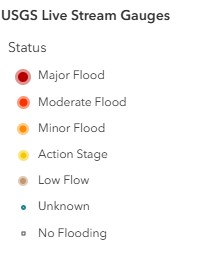
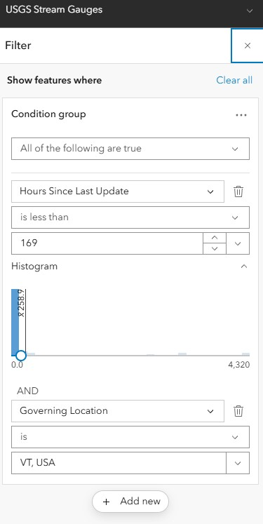
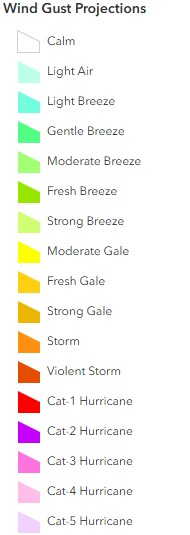

# Weather Map

The weather map provides a comprehensive, real-time view focused on current meteorological conditions across Vermont by integrating multiple data sources to support emergency operations.


*The weather map (named Weather - Current) is accessible [here](https://vtem.maps.arcgis.com/apps/mapviewer/index.html?webmap=7b83342cdde44453bd3688762394bef1). It contains both grouped and ungrouped layers from internal and external sources.*

## Purpose

This map provides detailed weather information for:

- Pre-event planning and preparation
- Storm tracking and monitoring
- Historical weather analysis
- Forecast verification

## Data Layers

!!! warning "Layer Visibility"
    Many layers are only turned on (visbile by Default) seasonally or during SEOC activation. For example, NWS Ice Accumulation would only be turned on with sufficient warning of an impending ice storm.

| Group | Layer Name | Symbology | Source |
|-------|------------|----------------|-------------|
|  | NWS Weather Stations | Classified by `Wind Speed (km/h)` | [NWS](https://services9.arcgis.com/RHVPKKiFTONKtxq3/arcgis/rest/services/NOAA_METAR_current_wind_speed_direction_v1/FeatureServer/0) |
|  | Road Weather Information Stations (RWIS) | ESRI basic point | [VTrans](https://gis.ne-compass.com/server/rest/services/Hosted/Vermont_View/FeatureServer/5) |
|  | RAWS Weather Stations |ESRI basic point  | [NIFC](https://services3.arcgis.com/T4QMspbfLg3qTGWY/arcgis/rest/services/PublicView_RAWS/FeatureServer/1) |
|  | USGS Live Stream Gauges | Classified by `Status` | [USGS](https://services9.arcgis.com/RHVPKKiFTONKtxq3/arcgis/rest/services/Live_Stream_Gauges_v1/FeatureServer/0) |
|  | Red Cross Trailer Locations | ESRI basic point | [Red Cross](https://services.arcgis.com/pGfbNJoYypmNq86F/ArcGIS/rest/services/ARCNNETrailerLocations/FeatureServer/0) |
| Weather | USA Storm Reports | Classified by `INCIDENT_TYPE` | [NOAA](https://rhvpkkiftonktxq3.svcs9.arcgis.com/RHVPKKiFTONKtxq3/ArcGIS/rest/services/NOAA_storm_reports_v1/FeatureServer/4) |
| Weather | NOAA Hail Storm Reports | ESRI basic point | [NOAA](https://services9.arcgis.com/RHVPKKiFTONKtxq3/arcgis/rest/services/NOAA_storm_reports_v1/FeatureServer/0) |
| Weather | NOAA Wind Storm Reports | ESRI basic point | [NOAA](https://services9.arcgis.com/RHVPKKiFTONKtxq3/arcgis/rest/services/NOAA_storm_reports_v1/FeatureServer/2) |
| Weather | Current NWS Events | Classified by `Subject Type` | [NOAA](https://services9.arcgis.com/RHVPKKiFTONKtxq3/arcgis/rest/services/NWS_Watches_Warnings_v1/FeatureServer/6) |
| Weather | NOAA Severe Thunderstorm Warnings | ESRI basic polygon | [NOAA](https://services9.arcgis.com/RHVPKKiFTONKtxq3/arcgis/rest/services/NOAA_short_term_warnings_v1/FeatureServer/0) |
| Weather | NOAA Tornado Warnings | ESRI basic polygon | [NOAA](https://services9.arcgis.com/RHVPKKiFTONKtxq3/arcgis/rest/services/NOAA_short_term_warnings_v1/FeatureServer/1) |
| Weather | NOAA Flash Flood Warnings | ESRI basic polygon | [NOAA](https://services9.arcgis.com/RHVPKKiFTONKtxq3/arcgis/rest/services/NOAA_short_term_warnings_v1/FeatureServer/2) |
| Weather | NOAA Special Marine Warnings | ESRI basic polygon | [NOAA](https://services9.arcgis.com/RHVPKKiFTONKtxq3/arcgis/rest/services/NOAA_short_term_warnings_v1/FeatureServer/3) |
| Weather | Active Hurricanes, Cyclones, & Typhoons | Multiple layers | [NOAA](https://services9.arcgis.com/RHVPKKiFTONKtxq3/arcgis/rest/services/Active_Hurricanes_v1/FeatureServer) |
| Weather| Wind Gust Projections | Classified by `Speed Class` | [NWS](https://services9.arcgis.com/RHVPKKiFTONKtxq3/arcgis/rest/services/NDFD_WindGust_v1/FeatureServer/0) |
| Weather | NWS Radar | Classified by `conus_bref_qcd` | [NWS](https://opengeo.ncep.noaa.gov/geoserver/conus/conus_bref_qcd/ows) |
| Winter Weather| Ice Accumulation Forecast | Multiple layers | [NWS](https://hub.arcgis.com/maps/esri2::national-weather-service-ice-accumulation-forecast-1/about) |
| Winter Weather| Snowfall Forecast | Multiple layers | [NWS](hhttps://www.arcgis.com/home/item.html?id=be1bb766bf1c44a9be97bbb7c04355ff) |
| Drought| Public Reports CMOR | ESRI basic point | [CMOR](https://services5.arcgis.com/0OTVzJS4K09zlixn/ArcGIS/rest/services/CMOR_2022_Public/FeatureServer/0) |
| Drought | US Drought Monitor -Current | Classified by `DM` | [USDM](https://services5.arcgis.com/0OTVzJS4K09zlixn/ArcGIS/rest/services/USDM_current/FeatureServer/0) |


### Reference Layers
*The reference layers group is at the top of the table of contents to create a visual mask so that data within Vermont is highlighted, but the user can still data in surrounding states.*


<div class="no-datatable" markdown="1">

| Group | Layer Name | Type | Source |
|-------|------------|------|--------|
| Boundaries | U.S. States and Territories | Polygon | [NOAA](https://services9.arcgis.com/RHVPKKiFTONKtxq3/arcgis/rest/services/NWS_Watches_Warnings_v1/FeatureServer/4) |
| Boundaries | Vermont Counties | Polygon | [VCGI](https://geodata.vermont.gov/datasets/VCGI::vt-data-county-boundaries-1/about) |
| Boundaries | Vermont Towns | Polygon | [VCGI](https://geodata.vermont.gov/datasets/VCGI::vt-data-town-boundaries-1/about) |
| Boundaries | NA Political Divisions Polygons (mask) | Polygon | [NAEA](https://services7.arcgis.com/oF9CDB4lUYF7Um9q/arcgis/rest/services/NA_Political_Divisions_Polygons/FeatureServer/6) |

</div>

## Layer Details

### External Sources
*The following layers are consumed from external, authoritative sources. These sources include Vermont agencies and departments and external partners like the NWS, USGS, FEMA, etc.*

??? info "NWS Weather Stations"
    **Source:** [NWS](https://services9.arcgis.com/RHVPKKiFTONKtxq3/arcgis/rest/services/NOAA_METAR_current_wind_speed_direction_v1/FeatureServer/0)  
    **Geometry Type:** Point  
    **Coordinate System:** Web Mercator (EPSG:3857)  
    **Update Method:** Automatically updated by NWS

    **Pop-Up Attributes:**
    
    - `STATION_NAME`: Unique weather station name
    - `OBS_DATETIME`: Date and time of reported observation
    - `WIND_DIRECT`: Wind direction recorded by weather station (in degrees)
    - `WIND_SPEED`: Wind speed recorded by weather station (in km/h)
    - `TEMP`: Temperature recorded by the weather station (in fahrenheit)
    - `SKY_CONDTN`: Description of sky conditions
    - `VISIBILITY`: A measure of the horizontal distance at which a person can clearly see and identify a prominent dark object against the horizon sky (during the day) or a moderately intense light source (at night)

    **Symbology:**

    Color-coded by `WIND_SPEED`<br>
    Icon: Geometric symbols imported from ESRI basic polygons<br><br>
        

    **Filter:**

    Filtered by `Country Name`<br><br>
        

    !!! warning "NWS Weather Stations Updates"
        NWS weather data is "near real-time. The data displayed in the weather map is typically 5 to 20 minutes old and the standard update cycle is only once per hour unless something of importance happens.

??? info "Road Weather Information Stations - (RWIS)"
    **Source:** [VTrans](https://gis.ne-compass.com/server/rest/services/Hosted/Vermont_View/FeatureServer/5)  
    **Geometry Type:** Point
    **Coordinate System:** Vermont State Plane (EPSG:32145)<br>
    **Update Method:** Automatically updated by VTrans

    **Pop-Up Attributes:**
    
    - `Name`: Unique weather station name
    - `Status`: This field is strictly reporting the health of the communication link
    - `roadway`: Roadway adjance to the weather station
    - `AirTemp`: Standard ambient air temperature (in fahrenheit)
    - `DewPoint`: A value derived from the air temperature and relative humidity sensors (in fahrenheit)
    - `WindSpeed`: Wind direction recorded by weather station (in mph)
    - `WindDir`: Wind direction recorded by weather station (in degrees)
    - `Direction`: Wind speed recorded by weather station (in km/h)
    - `PavementTemp`: The actual temperature of the road pavement
    - `PrecipRate`: Intensity of rainfall or snowfall (in/hr)
    - `RoadSurfaceCond`: The condition of the roadway. Values typically include: dry, wet, chemically wet, ice, snow, slush
    - `SubsurfaceTemp`: The temperature of the soil ~18 inches below the road
    - `SurfaceFriction`: WA calculated value (often 0.0 to 1.0) representing how slippery the surface is
    - `Visibility`: Distance one can see (in miles)
    - `Timestamp`: Date and time of reported observation


    **Symbology:**

    ESRI basic point<br>
    Icon: Geometric symbols imported from ESRI basic polygons<br><br>
        

    !!! warning "Road Weather Information Stations Updates"
        RWIS weather data is "near real-time. The stations are programmed to report a new observation every 10 minutes. During active winter storms, VTrans can remotely command stations to switch to "polling mode" or increase their reporting frequency (~5 minutes)

??? info "RAWS Weather Stations"
    **Source:** [NIFC](https://services3.arcgis.com/T4QMspbfLg3qTGWY/arcgis/rest/services/PublicView_RAWS/FeatureServer/1)  
    **Geometry Type:** Point
    **Coordinate System:** WGS1984 (EPSG:4326) 
    **Update Method:** Automatically updated by NIFC

    **Pop-Up Attributes:**
    
    - `Agency`: Agency that owns the stations (e.g., USFS, BLM, etc.).
    - `StationName`: Unique weather station name
    - `Status`: Weather station status (A = Active, I = Inactive, M = Maintenance)
    - `Ob Time`: The time the sensor actually took the reading
    - `Elevation`: Ground elevation of the weather station (in feet)
    - `Air Temperature, Standard Placement`: Standard ambient air temperature (in fahrenheit)
    - `Relative Humidity`: The percentage of water vapor present in the air compared to the maximum amount the air can hold at the same temperature (in %)
    - `Rain Accumulation`: Cumulative rainfall at the site, relative to a start date on October 1st (rainfall = 0) and accumulate until September 30th of the following year
    - `Wind Speed MPH`: Wind speed recorded by weather station (in mph)
    - `Wind Direction`: Wind direction recorded by weather station (in degrees)
    - `Solar Radiation`: The intensity of sunlight hitting the ground (in W/m²)
    - `Fuel Moisture`: The moisture content of dead vegetation (specifically "10-hour" fuels, which are sticks 1/4" to 1" in diameter) - (in %)
    - `Fuel Temperature`: The temperature of the fuel stick
    - `MesoWest Detailed Weather Link`: A website run by the University of Utah that aggregates all US weather data
    - `NOAA Detailed Weather Link`: The National Weather Service observations page

    **Symbology:**

    ESRI basic point<br>
    Icon: Geometric symbols imported from ESRI basic polygons<br><br>
        

    Filtered by `State`<br><br>
        

    !!! warning "RAWS Weather Stations Updates"
        RAWS weather data is "near real-time. The stations are programmed to report a new observation every hour.

??? info "USGS Stream Gauges"
    **Source:** [USGS](https://services9.arcgis.com/RHVPKKiFTONKtxq3/arcgis/rest/services/Live_Stream_Gauges_v1/FeatureServer/0) 
    **Geometry Type:** Point
    **Coordinate System:** Web Mercator (EPSG:3857)
    **Update Method:** Automatically updated by USGS

    **Pop-Up Attributes:**
    
    - `stationid`: The unique 8-to-15 digit identifier assigned by the USGS
    - `org`: The agency managing the data feed. Usually USGS, but can sometimes include partners like USACE or local water districts
    - `name`: Location description (river + town + state)
    - `status`: The current flood condition relative to NWS flood thresholds 
    - `height`: Refers to gauge height; the vertical distance of the water surface above the station's reference datum (in ft)  
    - `flow`: Refers to discharge; the volume of water moving down the river (in cfs)
    - `governing_location`: Describes the general location of the gauge (State, USA) 
    - `lastupdate`: The timestamp of the most recent data received from the gauge 

    **Symbology:**

    ESRI basic point<br>
    Icon: Geometric symbols imported from ESRI basic polygons<br><br>
        

    Filtered by `State`<br><br>
        

    !!! warning "USGS Stream Gauges Updates"
        USGS gauges typically update every 15 to 60 minutes.

??? info "USA Storm Reports (past 24 hours)"
    **Source:** [NOAA](https://rhvpkkiftonktxq3.svcs9.arcgis.com/RHVPKKiFTONKtxq3/ArcGIS/rest/services/NOAA_storm_reports_v1/FeatureServer/4)<br> 
    **Geometry Type:** Point  
    **Coordinate System:** Web Mercator (EPSG:3857)<br> 
    **Update Method:** Updated daily by NOAA/NWS

    **Pop-Up Attributes:**
    
    - `INCIDENT_TYPE`: Type of storm incident (e.g., Heavy Snow, Snow, Sleet, Hail, etc.)
    - `LOCATION`: Description of location
    - `INCIDENT_DATETIME`: Timestamp for storm report
    - `COUNTY`: County name
    - `STATE`: State name
    - `COMMENTS`: Relevant comments
  
    **Symbology:**

    Color-coded by `report_type`<br>
    Icon: Pre-defined symbology by NOAA<br><br>
        

    **Filter:**

    Filtered by `HOURS_OLD` and `location`<br><br>
        

    !!! warning "Data Limitations"
        Weather alert data may be delayed during severe weather events when NWS systems experience heavy load.

??? info "NOAA Hail Storm Reports (past 24 hours)"
    **Source:** [NOAA](https://services9.arcgis.com/RHVPKKiFTONKtxq3/arcgis/rest/services/NOAA_storm_reports_v1/FeatureServer/0)<br> 
    **Geometry Type:** Point  
    **Coordinate System:** Web Mercator (EPSG:3857)<br> 
    **Update Method:** Updated daily by NOAA/NWS

    **Pop-Up Attributes:**
    
    - `LOCATION`: Description of location
    - `UTC_DATETIME`: Timestamp for hail report
    - `COUNTY`: County name
    - `STATE`: State name
    - `COMMENTS`: Relevant comments
  
    **Symbology:**

    ESRI basic point<br>
    Icon: Pre-defined symbology by NOAA<br><br>
        

    **Filter:**

    Filtered by `STATE`<br><br>
        

??? info "NOAA Wind Storm Reports (past 24 hours)"
    **Source:** [NOAA](https://services9.arcgis.com/RHVPKKiFTONKtxq3/arcgis/rest/services/NOAA_storm_reports_v1/FeatureServer/2)<br>
    **Geometry Type:** Point  
    **Coordinate System:** Web Mercator (EPSG:3857)<br>
    **Update Method:** Updated daily by NOAA/NWS

    **Pop-Up Attributes:**
    
    - `LOCATION`: Description of location
    - `UTC_DATETIME`: Timestamp for hail report
    - `COUNTY`: County name
    - `STATE`: State name
    - `COMMENTS`: Relevant comments
  
    **Symbology:**

    ESRI basic point<br>
    Icon: Pre-defined symbology by NOAA<br><br>
        

    **Filter:**

    Filtered by `STATE`<br><br>
        

??? info "Current NWS Events"
    **Source:** [NOAA](https://services9.arcgis.com/RHVPKKiFTONKtxq3/arcgis/rest/services/NWS_Watches_Warnings_v1/FeatureServer/6)<br>
    **Geometry Type:** Polygon 
    **Coordinate System:** Web Mercator (EPSG:3857)<br>
    **Update Method:** Updated daily by NOAA/NWS

    **Pop-Up Attributes:**
    
    - `Event`: NWS event type (e.g., Flash Flood Watch, Fire Warning, Winter Weather Advisory, etc.)<br>
    - `Affected`: Geographic areas affected
    - `Summary`: Concatonated summary of event, time period of event, and issuing NWS office.
    - `Updated`: Time/date last updated
    - `Start`: Start time of event notice
    - `End`: End time of event notice
    - `Description`: Detailed description of the NWS event
    - `Instruction`: Authoritative instructions for how to prepare/respond to NWS event

    **Symbology:**

    Color-coded by `Subject Type`<br>
    Icon: Pre-defined symbology by NOAA<br><br>
        

    **Filter:**

    Filtered by `Summary Overview`<br><br>
        

    !!! warning "Data Limitations"
        Weather alert data may be delayed during severe weather events when NWS systems experience heavy load. Polygons represent alert zones, not exact impact areas.

??? info "NOAA Severe Thunderstorm Warnings"
    **Source:** [NOAA](https://services9.arcgis.com/RHVPKKiFTONKtxq3/arcgis/rest/services/NOAA_short_term_warnings_v1/FeatureServer/0)<br>
    **Geometry Type:** Polygon  
    **Coordinate System:** Web Mercator (EPSG:3857)<br>
    **Update Method:** Updated daily by NOAA/NWS

    **Pop-Up Attributes:**
    
    - `UTC_ISSUE`: Date/time warning was issued
    - `UTC_EXPIRE`: Date/time warning expires
  
    **Symbology:**

    ESRI basic polygon<br>
    Icon: Pre-defined symbology by NOAA<br><br>
        

    **Filter:**

    Filtered by `to be determined`<br><br>
        

??? info "NOAA Tornado Warnings"
    **Source:** [NOAA](https://services9.arcgis.com/RHVPKKiFTONKtxq3/arcgis/rest/services/NOAA_short_term_warnings_v1/FeatureServer/1)<br>
    **Geometry Type:** Polygon  
    **Coordinate System:** Web Mercator (EPSG:3857)<br>
    **Update Method:** Updated daily by NOAA/NWS

    **Pop-Up Attributes:**
    
    - `UTC_ISSUE`: Date/time warning was issued
    - `UTC_EXPIRE`: Date/time warning expires
  
    **Symbology:**

    ESRI basic polygon<br>
    Icon: Pre-defined symbology by NOAA<br><br>
        

    **Filter:**

    Filtered by `to be determined`<br><br>
        

??? info "NOAA Flash Flood Warnings"
    **Source:** [NOAA](https://services9.arcgis.com/RHVPKKiFTONKtxq3/arcgis/rest/services/NOAA_short_term_warnings_v1/FeatureServer/2)<br>
    **Geometry Type:** Polygon  
    **Coordinate System:** Web Mercator (EPSG:3857)<br>
    **Update Method:** Updated daily by NOAA/NWS

    **Pop-Up Attributes:**
    
    - `UTC_ISSUE`: Date/time warning was issued
    - `UTC_EXPIRE`: Date/time warning expires
  
    **Symbology:**

    ESRI basic polygon<br>
    Icon: Pre-defined symbology by NOAA<br><br>
        

    **Filter:**

    Filtered by `to be determined`<br><br>
        

??? info "NOAA Special Marine Warnings"
    **Source:** [NOAA](https://services9.arcgis.com/RHVPKKiFTONKtxq3/arcgis/rest/services/NOAA_short_term_warnings_v1/FeatureServer/3)<br>
    **Geometry Type:** Polygon  
    **Coordinate System:** Web Mercator (EPSG:3857)<br>
    **Update Method:** Updated daily by NOAA/NWS

    **Pop-Up Attributes:**
    
    - `UTC_ISSUE`: Date/time warning was issued
    - `UTC_EXPIRE`: Date/time warning expires
  
    **Symbology:**

    ESRI basic polygon<br>
    Icon: Pre-defined symbology by NOAA<br><br>
        

    **Filter:**

    Filtered by `to be determined`<br><br>
        

??? info "Active Hurricanes, Cyclones, and Typhoons"
    **Source:** [NOAA](https://services9.arcgis.com/RHVPKKiFTONKtxq3/arcgis/rest/services/Active_Hurricanes_v1/FeatureServer)<br>
    **Geometry Type:** Points, Lines, Polygons 
    **Coordinate System:** Web Mercator (EPSG:3857)<br>
    **Update Method:** Updated daily by NOAA/NWS

    **Grouped Feature Layer**<br>
    This grouped service contains the following layers, which depict active hurricanes and associated storm characteristics.
    
    - Forecast Position
    - Observied Position
    - Forecast Track
    - Observed Track
    - Forecast Error Cone and Danger Area
    - Watches and Warnings
    - Tropical Storm Force (34kts)
    - Tropical Storm Force (50kts)
    - Tropical Storm Force (64kts+)
    - Raw 1 10th Degree Data (All)
    - Observed Wind Swath
  
    **Symbology:**

    Point, Polyline, Polygon<br>
    Icon: Pre-defined symbology by NOAA<br><br>
        

??? info "Wind Gust Projections"
    **Source:** [NWS](https://services9.arcgis.com/RHVPKKiFTONKtxq3/arcgis/rest/services/NDFD_WindGust_v1/FeatureServer/0) 
    **Geometry Type:** Polygon 
    **Coordinate System:** Web Mercator (EPSG:3857)  
    **Update Method:** Automatically updated by NWS

    **Pop-Up Attributes:**
    
    - `label`: The forecasted gust speed Range (in mph and km/h)
    - `Speed Class (Beaufort Scale)`: The Beaufort wind force scale category description (e.g., Gentle Breeze, Strong Breeze, Violent Storm, etc.)
    - `Description`: The Beaufort scale description combined with label
    - `From Date`: The beginning of the valid forecast period
    - `To Date`: The end of the valid forecast period
 
    **Symbology:**

    Color-coded by `Speed Class (Beaufort Scale)`<br>
    Icon: Geometric symbols imported from ESRI basic polygons<br><br>
        

    !!! warning "Wind Gust Projections"
        NWS forecasts are often broken into 1-hour, 3-hour, or 6-hour blocks. A polygon on the map represents the maximum gust expected between the `From Date` and `To Date`.

??? info "NWS Radar"
    **Source:** [NWS](https://opengeo.ncep.noaa.gov/geoserver/conus/conus_bref_qcd/ows)<br>
    **Geometry Type:** n/a (Image Service)  
    **Coordinate System:** WGS1984 (EPSG:4326)<br>
    **Update Method:** Automatically updated by ESRI

    This image service displays the NWS CONUS_BREF_QCD radar product. CONUS = Continental United States, BREF = Base Reflectivity, which is the "raw" echo intensity from the lowest tilt of the radar (0.5°), which shows what is happening closest to the ground, and QCD = Quality Controlled Data. This means the NWS has run an algorithm to remove "non-meteorological" noise, such as ground clutter (buildings/mountains) or sun spikes, to clean up the image. Units are dBZ (Decibels of Z), which is a logarithmic scale representing the energy reflected back to the radar dish.

    **Symbology:**

    ESRI Image Service<br>
    Color Ramp: Pre-defined symbology by NWS<br><br>
        

    **dBZ Range Interpretation:**

    *This table outlines the standard relationship between radar reflectivity values (measured in dBZ) and precipitation intensity. Note that the same dBZ value indicates different conditions depending on whether the precipitation is liquid (rain) or frozen (snow/hail). While high values (>50 dBZ) typically indicate heavy rain in summer, even moderate values (30–40 dBZ) can signify dangerous whiteout conditions during winter storms.*

    <div class="no-datatable" markdown="1">

    | dBZ Range | Intensity Category | Summer Interpretation | Winter Interpretation |
    |-------|------------|------|--------|
    | < 10 | Non Precipitation | Clouds, fog, smoke, or dust | Very light snow flurries or ice crystals |
    | 10 - 20 | Very Light | Light mist or drizzle | Winter Light snow (trace accumulation) |
    | 20 - 30 | Light | Light steady rain | Moderate snow accumulation |
    | 30 - 40 | Moderate | Moderate rain | Heavy snow (whiteout conditions) |
    | 40 - 50 | Heavy | Heavy rain | Extremely heavy snow or sleet mix |
    | 50 - 60 | Intense | Very heavy rain / thunderstorms | Hail is likely forming |
    | 60 - 70 | Extreme | Flash flood producing rain | Severe hail (golf ball+ size) |
    | > 70 | Catastrophic | Extreme storm core | Giant hail (baseball+ size or debris) |
    
    </div>

??? info "NWS Ice Accumulation Forecast"
    **Source:** [NWS](https://hub.arcgis.com/maps/esri2::national-weather-service-ice-accumulation-forecast-1/about)<br>
    **Geometry Type:** Points, Lines, Polygons 
    **Coordinate System:** Web Mercator (EPSG:3857)<br>
    **Update Method:** Updated daily by NWS

    **Grouped Feature Layer**<br>
    This grouped service contains the following layers, which depict variations on ice accumulation forecasts from the NWS:
    
    - Amount by Time
    - Accumulation by Time
    - Cumulative Total
  
    **Pop-Up Attributes:**<br>
    *The attributes below is the same for all three layers.*

    - `label`: Summarizes forecasted accumulation range (in inches)
    - `fromdate`: The beginning of the valid forecast period
    - `todate`: The beginning of the valid forecast period

    **Symbology:**<br>
      *The symbology below is the same for all three layers.*

    ESRI basic polygon<br>
    Icon: Pre-defined symbology by NWS<br><br>
        

??? info "NWS Snowfall Forecast"
    **Source:** [NWS](hhttps://www.arcgis.com/home/item.html?id=be1bb766bf1c44a9be97bbb7c04355ff))<br>
    **Geometry Type:** Points, Lines, Polygons 
    **Coordinate System:** Web Mercator (EPSG:3857)<br>
    **Update Method:** Updated daily by NWS

    **Grouped Feature Layer**<br>
    This grouped service contains the following layers, which depict variations on snowfall forecasts from the NWS:
    
    - Amount by Time
    - Accumulation by Time
    - Cumulative Total
  
    **Pop-Up Attributes:**<br>
    *The attributes below is the same for all three layers.*

    - `label`: Summarizes forecasted accumulation range (in inches)
    - `fromdate`: The beginning of the valid forecast period
    - `todate`: The beginning of the valid forecast period

    **Symbology:**<br>
      *The symbology below is the same for all three layers.*

    ESRI basic polygon<br>
    Icon: Pre-defined symbology by NWS<br><br>
        

??? info "Public Reports - CMOR"
    **Source:** [CMOR](https://services5.arcgis.com/0OTVzJS4K09zlixn/ArcGIS/rest/services/CMOR_2022_Public/FeatureServer/0)<br>
    **Geometry Type:** Point  
    **Coordinate System:** WGS1984 (EPSG:4326)<br>
    **Update Method:** Automatically updated by the CMOR via public submissions

    **Pop-Up Attributes:**
    
    - `Description and/or caption information`: User submitted observations
    - `Select a county`: County of submission/observation
    - `What is the date?`: Date of submission

    **Symbology:**

    ESRI basic point<br>
    Icon: Pre-defined symbology by CMOR<br><br>
        

    **Filter:**

    Filtered by `Select a state/territory`<br><br>
        
    
    !!! warning "CMOR Updates"
        CMOR submissions are provided via public submission and should be verified prior to mobilizing resources.

??? info "US Drought Monitor - Current"
    **Source:** [USDM](https://services5.arcgis.com/0OTVzJS4K09zlixn/ArcGIS/rest/services/USDM_current/FeatureServer/0)<br>
    **Geometry Type:** Polygon  
    **Coordinate System:** Web Mercator (EPSG:3857)<br>
    **Update Method:** Manually updated (weekly) by the National Drought Mitigation Center

    **Pop-Up Attributes:**
    
    - `DM`: Drought Monitor Category (e.g., Abnormally Dry, Severe Drought, etc.)
    - `DMArea_Units`: The raw area of the drought polygon in square miles (mi²)
    - `CatagoricalPerct`: The percentage of the area exclusively in each specific drought category
    - `CumulativePerct`: This is the "or worse" statistic. It represents the percentage of the area in the specific drought category plus all more severe categories
    - `ReleaseDate`: The release date of the updated feature layer
    - `ValidStart`: The start date of the observation week
    - `ValidEnd`: The end date of the observation week

    **Attribute Expressions (Arcade):**<br><br>
    The original `DMArea` field was rounded and units were added for easier interpretation using the `DMArea_Units` field.<br>
    ```arcade
        Text($feature.DMArea, '#,###') + " mi²"
    ```
        

    **Symbology:**

    ESRI basic polygon<br>
    Icon: Pre-defined symbology by USDM<br><br>
        

### Basemap
Default: **Topographic** for visualizing data relative to Vermont's variable topography

## Performance Notes

For optimal performance with this map:

- Recommended to keep 4-5 layers active simultaneously
- Turn off reference layers when not needed
- Use time filters to limit historical data queries

## Related Documentation

- [Situational Awareness Map](situational-awareness-map.md)
- [Fire Risk Map](fire-risk-map.md)
