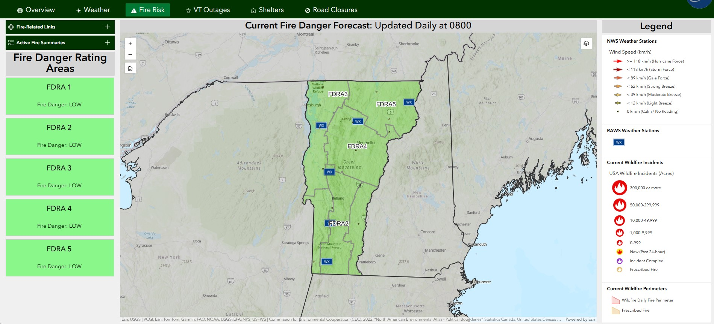

# Fire Risk Page

The Fire Risk page provides a daily overview of fire danger and recent wildfire activity in Vermont.

## Purpose

This page provides:

- Daily overview of fire danger conditions reported by VTFPR
- Summary of current wildfire incidents and perimeters
- Metorologic conditions reported by and RAWS and NWS weather stations

## Fire Risk Page Layout

The page uses a **fullscreen layout** with the following components:

1. **Header**: Application title, dynamic status text and color, date/time, and logo. Review the COP [Overview Page](overview-page.md/#header-section) for more details.
2. **Navigation**: Tab-based navigation between different views. Review the COP [Overview Page](overview-page.md/#header-section) for more details.
3. **Map Area**: Primary interactive map area.
4. **Side Columns**: Widgets for data display and interaction.

### Map Section
The center visual of the page contains the fire risk map. For more information on the data layers displayed in the map, visit the [Fire Risk Map](../maps/fire-risk-map.md) page. The map widget contains the same Zoom Controls, Home Button, Search, and Layers Toggle tools as the Overview Map. Please review those tool features [here](overview-page.md/#map-section).

### Accordian Sections
The page displays a left and right column containing column and accordian widgets, which allow users to expand/contract content linked to data layers in the map.

??? info "Click For More Info"

    - **Fire Related Links Accordian Widget**: The primary accordian widget contains a Text Widget, which contains two links to external fire-related resources. 
        - EGP Wildfire SA Dashboard = [External Link](https://egp.wildfire.gov/maps/?lat=43.989052&lon=-73.449053&zoom=9&regionId=EACC0&dimension=2d)
        - Wildfire Preparedness Levels = [External Link](https://fpr.vermont.gov/wildfire-situation)  

    - **Active Fire Summaries Accordian Widget**: The primary accordian widget contains a List Widget linked to the [NIFC Current Wildfire Incidents](https://services9.arcgis.com/RHVPKKiFTONKtxq3/arcgis/rest/services/USA_Wildfires_v1/FeatureServer/0) layer. Each entry in the list reports out the Unique Fire ID using the `Unique Fire Identifier` field and Daily Acres using the `Daily Acres` field. 
            

            
            
            

    - **Fire Danger Rating Areas Column Widget**: The primary Column Widget contains a List Widget linked to the [VTFPR Fire Danger](https://anrmaps.vermont.gov/arcgis/rest/services/map_services/MAP_ANR_ANRATLASFPR_WM_NOCACHE/MapServer/50) layer. Each entry in the list reports out the FDRA using the `FDRA` field and daily Fire Danger using the `FIREDANGER` field.

        - **Fire Danger Styling**: When the Fire Danger in the `VTFPR Fire Danger` layer is updated, the background color of the list text background is dynamically styled:

            

            | Fire Danger | Hex | Swatch |
            | :--- | :--- | :--- |
            | Low| #89f789 |  |
            | Moderate | #60ceff |  |
            | High | #e89d00 |  |
            | Very High | #db7d44 |  |
            | Extreme | #A80000 |  |

            The image on the left illustrates how the Fire Danger Rating Areas list is displayed to the user on the Fire Risk page and the image on the right illustrates how the background color is dynamically styled using the `Fire Danger` field.

            

            

            
            
            

    - **Fire Risk Map Legend Widget**: A Column Widget on the right side of the page contains a Legend Widget linked to the [Fire Risk Map](../maps/fire-risk-map.md). This allows the user to easily interpret the map symbology without having to open the Layers tool on the map itself.
        
        

## Best Practices

### Performance Optimization
- Keep 4-5 layers active for best performance
- Use appropriate zoom levels for data visibility
- Clear old incidents and events periodically
- Close unused widgets when not needed

### Data Interpretation
- Check timestamps on data feeds
- Verify alert severity levels
- Cross-reference multiple data sources
- Consider data aggregation levels

## Related Pages

- [VT Outages Page](vt-outages-page.md) - Power outage tracking
- [Mass Care Page](mass-care-page.md) - Detailed fire danger and current wildfire status
- [Infrastructure Page](infrastructure-page.md) - Transportation status

## Feedback

If you have suggestions for improving this page or need additional functionality, contact [John Van Hoesen](mailto:john.vanhoesen@vermont.gov).
