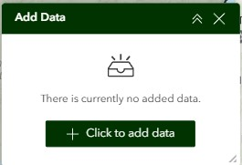

# Overview Page

The Overview page serves as the main dashboard for the VEM Common Operating Picture (COP), providing a comprehensive view of current statewide conditions.


*Serves as the main landing page for the VEM COP dashboard and provides a snapshot of SEOC status and key statewide emergency response related indicators.*

## Purpose

This page provides:

- Quick situational awareness of Vermont's current state
- Summary statistics and key indicators
- Multi-map synchronized views
- Access to all major operational functions

## Page Layout

The page uses a **fullscreen layout** with the following components:

1. **Header**: Application title, dynamic status text and color, date/time, and logo
2. **Navigation**: Tab-based navigation between different views
3. **Map Area**: Primary interactive map area
4. **Side Columns**: Widgets for data display and interaction

### Header Section
The header is the primary visual cue for the SEOC operations status and is visible on all pages of the COP. It contains the following elements:

??? info "Click For More Info"

    - **Text Widget**: Includes the title of the dashboard with a dynamic background color controlled by the SEOC Status.
        
        

        - **Status Styling**: When the SEOC status in the `VT EOCs - Status` layer is updated, the background color of the header is dynamically styled:

            <div class="no-datatable" markdown="1">

            | Status | Hex | Swatch |
            | :--- | :--- | :--- |
            | Level 1 - Normal Operations| #007834 | <span style="display:inline-block; width:20px; height:20px; background:#007834; border:1px solid #ccc;"></span> |
            | Level 2 - Enhanced Operations | #b5a400 | <span style="display:inline-block; width:20px; height:20px; background:#b5a400; border:1px solid #ccc;"></span> |
            | Level 3 - Partial Activation | #e89d00 | <span style="display:inline-block; width:20px; height:20px; background:#e89d00; border:1px solid #ccc;"></span> |
            | Level 4 - Full Activation | #bf0017 | <span style="display:inline-block; width:20px; height:20px; background:#bf0017; border:1px solid #ccc;"></span> |
            | Inactive | #525252 | <span style="display:inline-block; width:20px; height:20px; background:#525252; border:1px solid #ccc;"></span> |
            | Unknown | #b6b6b6 | <span style="display:inline-block; width:20px; height:20px; background:#b6b6b6; border:1px solid #ccc;"></span> |

            </div>

            The below illustrates how the SEOC status background color is list is dynamically styled using the `Status` field.

            

    - **Embed Widget**: A live time & date indicator tied to an html file hosted in VCGI's Azure blob storage.
        - **HTML Source**: The html supporting this indicator is available [here](https://vcgiblobapps.blob.core.windows.net/other/demo/vem-clock/vem-clock.html)
    
    - **Image Widget**: VEM randing logo available [here](../images/pages/vem_logo_0.png)
    - **Navigation Widget**: Horizontal tabs linked to individual pages. The color of each tab changes dynamically on hover and click.
           


### Sidecar Section
The left side of the page contains a Sidecar Widget the user can expand/contact. It contains the following elements:

??? info "Click For More Info"

    - **Sidecar Widget**: The primary container that is expanded by default, it contains numerous row widgets, which each contain an image widget and a text widget. Each row corresponds to a unique indicator connected to a data layer in the map widget.
        
        

        - **Indicator Sources**: Each indicator is updated using a data source from the [VT COP - Current map](../maps/situational-awareness-map.md):

            <div class="no-datatable" markdown="1">

            | Indicator | Data Source | Icon Source | Field Attribute Expression |
            | :--- | :--- | :--- | :--- | 
            | 511 Incidents| [VT 511](https://gis.ne-compass.com/server/rest/services/Hosted/Vermont_View/FeatureServer/2) | [Icon](../images/pages/cop-511-icon.png) | `COUNT({ObjectID})` |
            | Open Shelters | [VEM](https://vtem.maps.arcgis.com/home/item.html?id=33bf26076dc2417781babf229a5558d8&sublayer=1) | [Icon](../images/pages/cop-shelter-icon.png) | `COUNT({ObjectID})` |
            | Recovery Centers | [VEM](https://vtem.maps.arcgis.com/home/item.html?id=e8073b08a3364f47ba8ac27232c8459c&sublayer=3) | [Icon](../images/pages/cop-recovery-icon.png) | `COUNT({ObjectID})` |
            | 211 Calls | ⚠️ [VEM](https://vtem.maps.arcgis.com/home/item.html?id=e8073b08a3364f47ba8ac27232c8459c&sublayer=3) ⚠️ | [Icon](../images/pages/cop-211-icon.png) | `⚠️ TBD` |
            | Declared Disasters | [FEMA](https://gis.fema.gov/arcgis/rest/services/FEMA/DECS_ALL/FeatureServer/0) | [Icon](../images/pages/cop-disaster-icon.png) | `See Arcade Expression Below` |
            | Boil Water Notices | [VTANR](https://services5.arcgis.com/0OTVzJS4K09zlixn/ArcGIS/rest/services/USDM_current/FeatureServer/0)  | [Icon](../images/pages/cop-boil-icon.png) | `COUNT({WSID})` |
            | Boil Water Notices - Storm Related | [VTANR](https://anrmaps.vermont.gov/arcgis/rest/services/map_services/MAP_ANR_ANRATLASDWGWP_WM_NOCACHE/MapServer/18) | [Icon](../images/pages/cop-boil-storm-icon.png) | `COUNT({WSID})`|

            </div>

         **Arcade Expression Used in Sidecar Widget**: The following expression was used to visualize the Declared Disasters Indicator counts:<br>
         ```javascript title="Delcared Disasters: Declarations Unique Count"
         // Specify Declaration Number field name
         var fieldName = 'dec_number';

         // Create a FeatureSet containing one feature for each unique value in the specified field
         var uniqueValues = Distinct($dataSources["dataSource_2-198e89789a5-layer-65-198e896fdbf-layer-64"].layer, fieldName);

         // Return the count of the unique features.
         return Count(uniqueValues);
         ```   


### Map Section
The center visual of the page contains the situational awareness map. For more information on the data layers displayed in the map, visit the [Situational Awarness Map](../maps/situational-awareness-map.md) page. The map widget contains the following elements:

??? info "Click For More Info"

    - **Map Widget**: Includes a number of features that help the user explore relevant data layers.
        
        

        - **Map Tool Descriptions**: Each of the buttons on the map the following functionality to the user:

            <div class="no-datatable" markdown="1">

            | Tool | Icon | Description |
            | :--- | :--- | :--- |
            | Map Zoom Controls | {: width="30" } | The  +/- buttons in the top-left corner of the map, allows the user to zoom in and out. The user can also use the scroll wheel on their mouse. |
            | Home Button | {: width="30" } | Clicking this returns the user to the default map view. |
            | Zoom to Town Filter | {: width="30" } | When the user applys this filter, the map zooms to the selected town |
            | Active EOCs Filter | {: width="30" } | This filter is displayed and applied by default to ensure only the SEOC is displayed. When the map loads, the user can close the filter or turn this filter off to display all the municipal EOCs. |
            | Add Data Widget | {: width="30" } | This widget allows the user to add local and cloud-hosted data to the map. This data is only visible to the user and stored in the browser, it isn't uploaded into the COP application. |
            | Search | {: width="30" } | Allows the user to search for a specific address or enter coordinates. The map will zoom to the selected search result. |
            | Layers Toggle| {: width="30" } | Allows the user to display a list of layers available in the map. Some layers are turned off by default and can be toggled on using this tool. The user can also switch to a legend view to help interpret the map symbology. |

            </div>

    - **Zoom to Town Filter Widget**: After the user selects a town from the dropdown list, the map will zoom to the selected town. The user can clear the filter by clicking the 'Reset all filters' icon in the lower right corner (arrow inside of circle).
        
    
    - **Active EOCs Filter Widget**: In most cases, the user will just need to close this filter. However, the user can display all EOCs (State and municipal) by toggling the filter off. Updates for municipal EOCs are inconsistent, so the best option is to leave this filter toggled on.<br>
        

    - **Add Data Widget**: Users can add local data or provide a url to a web resource to display on the map. This is only saved for their map session and not uploaded to the COP dashboard.<br>
        

    - **Search Tool**: Users can select the geocoding service they want to use (VCGI composite is best for Vermont) and enter an address or coordinates.<br>
        

    - **Layers Button**: Users can add local data or provide a url to a web resource to display on the map. This is only saved for their map session and not uploaded to the COP dashboard.<br>
        - The screenshot on the left illustrates the list of available layers the user can turn on and off (by clicking the eye icon). The screenshot on the right displays the symbology associated with each visible data layer.
            <div style="display: flex; gap: 10px; align-items: flex-start;">
            
            
            </div>

### Accordian Sections
The right side of the page displays two columns containing accordian widgets, which allow users to expand/contract content linked to data layers in the map.

??? info "Click For More Info"

    - **VT511 CCTV Cameras Accordian Widget**: The primary accordian widget contains a List Widget linked to the [VT 511 CCTV Cameras](https://gis.ne-compass.com/server/rest/services/Hosted/Vermont_View/FeatureServer/0) layer. When expanded, the user can search for a specific camera name (magnifying glass icon), scroll through the images, and click on the magnify button (magnifying glass in rectangle) for a full-screen view of the image. When the user selects an image, the map will zoom to the location of the CCTV camera.
        
        

    - **Boil Water Notices Accordian Widget**: The primary accordian widget contains a Feature Info Widget linked to the [Boil Water Notices](https://services5.arcgis.com/0OTVzJS4K09zlixn/ArcGIS/rest/services/USDM_current/FeatureServer/0) table. The user can navigate between eatch feature summary using the navigation arrows. 
        
        

    - **Reported Spills Accordian Widget**: The primary accordian widget contains a Feature Info Widget linked to the [Reported Spills](https://anrmaps.vermont.gov/arcgis/rest/services/map_services/MAP_ANR_ANRATLASDWGWP_WM_NOCACHE/MapServer/17) table. The user can navigate between eatch feature summary using the navigation arrows.
        
        {: width="265" }

    - **⚠️ SEOC Status Summary Accordian Widget**: The primary accordian widget contains a Text Widget. This widget is still under development and needs to be tied to an appropriate data layer.
        
        

    - **⚠️ Overview Statistics Accordian Widget**: The primary accordian widget contains Text Widgets. These widget are a combination of smaller text indicators tied to the same layers in the Sidecare Widget and links out to relevant agencies and organization. This widget is still under development and needs to be updated.
        
        

    - **NWS Alerts & Warnings Accordian Widget**: The primary accordian widget contains a Feature Info Widget linked to the [NWS Current Events](https://services9.arcgis.com/RHVPKKiFTONKtxq3/arcgis/rest/services/NWS_Watches_Warnings_v1/FeatureServer/6) layer. The user can navigate between eatch feature summary using the navigation arrows. When the user navigates through each entry, the coverage area for each alert or warning is highlighted on the map. The user can clear the highlighting by clicking on the clear selection button (x inside dashed square). 
        
        


## Best Practices

### Performance Optimization
- Keep 4-5 layers active for best performance
- Use appropriate zoom levels for data visibility
- Clear old incidents and events periodically
- Close unused widgets when not needed

### Data Interpretation
- Check timestamps on data feeds
- Verify alert severity levels
- Cross-reference multiple data sources
- Consider data aggregation levels

## Related Pages

- [Weather Page](weather-page.md) - Detailed weather monitoring
- [Fire Risk Page](fire-risk-page.md) - Detailed fire danger and current wildfire status
- [VT Outages Page](vt-outages-page.md) - Power outage tracking

## Feedback

If you have suggestions for improving this page or need additional functionality, contact [John Van Hoesen](mailto:john.vanhoesen@vermont.gov).
